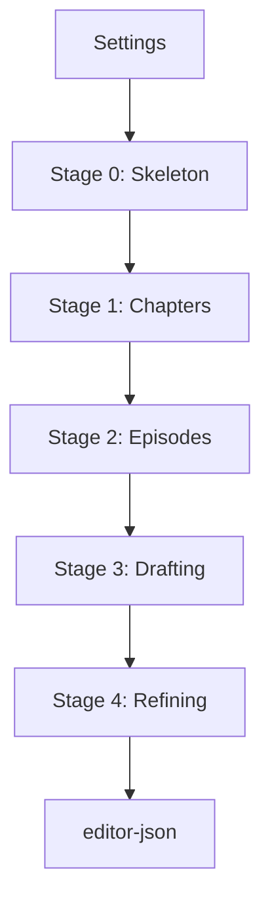

# 全工程マスター仕様書：Gemini 多段階シナリオ生成パイプライン

## 1. 概要
本ドキュメントは、プロジェクト設定からエディタ投入用 JSON 生成に至る、全 5 段階（Stage 0〜4）の入出力仕様およびモデル選定を定義する。

---

## 2. 全体フロー図

---

## 3. ステージ別詳細仕様

### Stage 0: 骨格生成 (Skeleton)
- **目的**: 全体の構成（篇・章）と核心的な伏線の配置。
- **モデル**: **Gemini 1.5 Pro**（200万トークンの広大な窓で設定全体を把握）
- **Input**: `overview.md`, `characters.md`, `plot.md`, `world.md`
- **Output**: `skeleton.json`
  - 構成: `arcs[]` > `chapters[]` (oneLiner, keyReveal)

### Stage 1: 章プロット (Chapters)
- **目的**: 各章の具体的なイベントと感情曲線の定義。
- **モデル**: **Gemini 1.5 Pro**
- **Input**: `skeleton.json` + `settings/`
- **Output**: `chapters.json`
  - 構成: `title`, `summary`, `keyEvents[]`, `emotionalArc`

### Stage 2: 話プロット (Episodes)
- **目的**: 各章を具体的な話（エピソード）とシーンに分割。
- **モデル**: **Gemini 2.5 Pro**（思考モデルにより因果関係を強化）
- **Input**: `chapters.json` + `genre-rules/*.yaml`
- **Output**: `chX_episodes.json`
  - 構成: `episodes[]` > `scenes[]` (location, time, characters, event)

### Stage 3: 本文ドラフト (Drafting) - [2パス・パス1]
- **目的**: 筋書きに基づいた大量のテキスト生成（初稿）。
- **モデル**: **Gemini 3.1 Flash-Lite**（爆速・格安・高品質なドラフト）
- **Input**: `chX_episodes.json` + `character_states`
- **Output**: `chX_epY_draft.json`
  - 構成: `lines[]` (narration, dialogue)

### Stage 4: JSON 成形 (Refining) - [2パス・パス2]
- **目的**: エディタ形式への変換、リライト、演出、制約適用。
- **モデル**: **Gemini 3.1 Pro**（最高知能による高品質な仕上げ）
- **Input**: `chX_epY_draft.json` + `config/<genre>.json`
- **Output**: `editor-json/page-XXX.json`
  - 構成: ブロック配列 (`start`, `bg`, `ch`, `text`, `jump`)

---

## 4. 共通資産と依存関係

### A. Manifest 管理
実行開始時に `config/<genre>.json` から以下のファイルを生成し、エディタとの整合性を保つ。
- `manifest.json`: プロジェクトメタ情報。
- `characters.json`: 使用可能キャラクターリスト。

### B. アセットID 解決
Stage 4 において、AI が以下のマッピングを解決する。
- **場所**: `zh_hall` (プロット名) → `$bg:bg_hall` (エディタID)
- **ポーズ**: `smile` (演出意図) → `expressionId: "normal"` (※現在は normal 固定)

---

## 5. テキスト制約（Stage 4 で適用）
- **1行**: 最大 46 文字。
- **1ブロック**: 最大 3 行。
- **改行**: `@r\n`。
- **禁止事項**: 鉤括弧 `「」` の原則排除、名前プレフィックスの削除。

---
*本仕様書は docs/10_ai_docs/2026/03/09/ 01〜06 の集大成として作成されました。*
