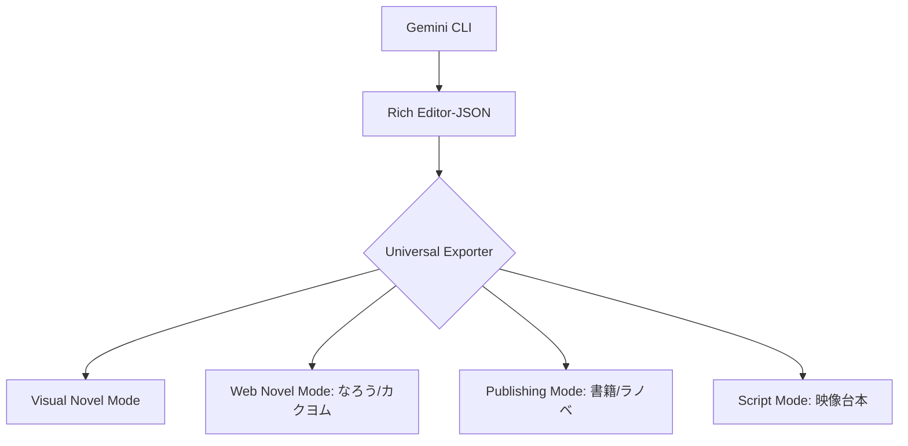

# 設計書：汎用コンテンツ変換エンジン (Universal Content Exporter)

## 1. 目的
Gemini CLI が出力した Rich Editor-JSON（構造化データ）をソースとし、ノベルゲーム以外の多様なプラットフォーム（Web小説、書籍、シナリオ台本等）に最適化された形式へ自動変換する仕組みを構築する。

## 2. アーキテクチャ

## 3. 変換定義 (Exporter Strategies)

### A. Web Novel Mode (なろう・カクヨム等)
- **作法**: 1〜2行ごとの改行、感嘆符後の全角スペース。
- **処理**: `text` ブロックを連結。`isThought` が `true` の場合は `（ ）` で囲う。
- **属性活用**: `emotion` が強い場合は、自動的に感嘆符を増やす（！）などの微調整。

### B. Publishing Mode (書籍・商業ラノベ)
- **作法**: 文頭の全角スペース（字下げ）、縦書き禁則処理。
- **処理**: 属性情報の「文章化（Narratizing）」。
- **文章化ロジック例**:
  - Input: `{ "speaker": "luca", "body": "行こう", "emotion": "決意", "action": "頷く" }`
  - Output: `「行こう」 　ルカは決意を込めて力強く頷くと、歩き出した。`

### C. Script Mode (ドラマ/映像台本形式)
- **作法**: 柱（場所）、ト書き、役名、セリフ。
- **処理**: `bg` ブロックを「柱」に、`ch.action` や `text.tone` を「ト書き」にマッピング。

## 4. Rich Data 活用による「文章の肉付け」
Rich JSON に含まれるメタデータを、Exporter が「形容詞」や「副詞」として文章に還元する。これにより、ゲーム用の短いセリフを、読み応えのある小説へと自動的にアップグレードする。

| Rich 属性 | 小説への反映例 |
| :--- | :--- |
| `tone: "囁き"` | 「〜」と、小声で囁いた。 |
| `weather: "雨"` | 降り頻る雨の音が、窓を叩いている。 |
| `wait: 2000` | ――沈黙が流れた。 |

## 5. 実装ステップ
1. **Core Parser**: Rich JSON を読み込み、章・話単位でシーケンシャルに処理する基盤を作成。
2. **Style Registry**: 媒体ごとのフォーマットルール（改行ルール、記号ルール）を定義。
3. **Template Engine**: 属性情報を自然言語に埋め込むための簡易テンプレート機能を実装。

---
*本設計は、ノベルゲームエンジンから「総合物語制作 SaaS」への進化を見据えたものである。*
