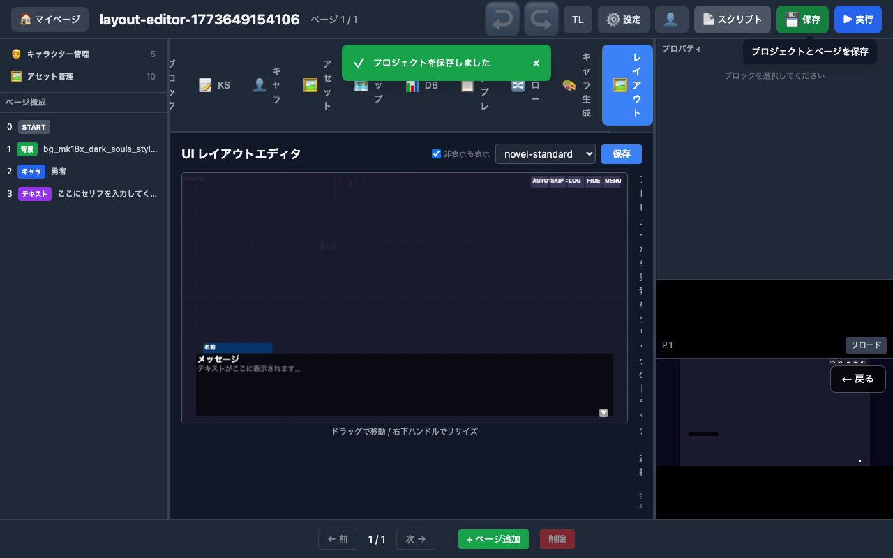

# UI レイアウトエディタ 動作確認レポート

**作成日**: 2026-03-16
**テスト環境**: ローカル開発環境 (http://localhost:5176)
**テストツール**: Playwright E2E（ヘッドレス Chromium）

---

## 1. 概要

PR #22 で実装された UI レイアウトエディタ（`LayoutEditor.tsx`, 359行）の動作確認結果を報告する。Playwright E2E テスト 4件が全て PASS し、スクリーンショットで視覚的にも正常動作を確認した。

---

## 2. テスト結果

| テスト | 結果 | 所要時間 |
|--------|:----:|---------|
| レイアウトタブが表示される | PASS | 3.9s |
| プリセット選択でレイアウトが切り替わる | PASS | 4.1s |
| 要素リストが表示される | PASS | 2.9s |
| 保存ボタンでプロジェクトに反映される | PASS | 4.1s |

---

## 3. 画面キャプチャ

### 3.1 エディタ全体（novel-standard プリセット）

- 「レイアウト」タブを選択するとエディタが表示される
- 1280×720 の論理解像度を 50% スケールでプレビュー
- メッセージウィンドウ、名前ボックス、クイックメニュー（AUTO/SKIP/LOG/HIDE/MENU）が表示
- グリッドガイド（40px 間隔）が薄く表示
- 「ドラッグで移動 / 右下ハンドルでリサイズ」のヒントテキスト

### 3.2 プリセット切替: rpg-classic

- プリセットドロップダウンから「rpg-classic」を選択
- メッセージウィンドウの位置・サイズが RPG 向けに変更
- クイックメニューの配置も変更

### 3.3 プリセット切替: cinematic

- 「cinematic」プリセット選択
- 全画面に近いレイアウト、UI 要素を最小限に

### 3.4 要素リスト

- 全20要素が日本語ラベル付きでリスト表示
- 各要素の座標・表示状態が確認可能

### 3.5 保存確認

- 「保存」ボタンクリック後、プロジェクトデータに playLayout が反映される

---

## 4. 実装機能一覧

| 機能 | 状態 |
|------|:----:|
| Canvas 2D プレビュー（50% スケール） | 実装済み |
| ドラッグで要素移動 | 実装済み |
| 右下ハンドルでリサイズ | 実装済み |
| 10種のプリセット選択 | 実装済み |
| 非表示要素の点線表示（トグル） | 実装済み |
| グリッドガイド（40px） | 実装済み |
| プロパティパネル（x/y/w/h/visible/opacity/zIndex） | 実装済み |
| 保存ボタン | 実装済み |
| 全20要素の日本語ラベル | 実装済み |

---

## 5. プリセット一覧（10種）

| プリセット名 | 用途 |
|-------------|------|
| novel-standard | ノベルゲーム標準（デフォルト） |
| novel-fullscreen | 全画面ノベル |
| novel-wide | ワイドスクリーンノベル |
| rpg-classic | RPG クラシック |
| rpg-battle | RPG バトル向け |
| rpg-field | RPG フィールド向け |
| message-top | メッセージ上部配置 |
| message-center | メッセージ中央配置 |
| minimal | 最小限 UI |
| cinematic | 映画的演出向け |

---

## 6. 結論

UIレイアウトエディタは **実用レベルで動作** している。ハンドオーバー資料で「未実装」と指摘された機能が、359行のコンポーネントで実現された。プリセット 10種とドラッグ＆ドロップ編集により、JSON 直接編集なしでプレイ画面の UI カスタマイズが可能になった。
