# ツクール機能 視覚的動作確認レポート

**作成日**: 2026-03-16
**テスト環境**: ローカル開発環境
**テストツール**: Playwright E2E（ヘッドレス Chromium, 1280x720）
**テスト結果**: 全 PASS

---

## 1. GameDb エディタ（データベース）

### アクター編集
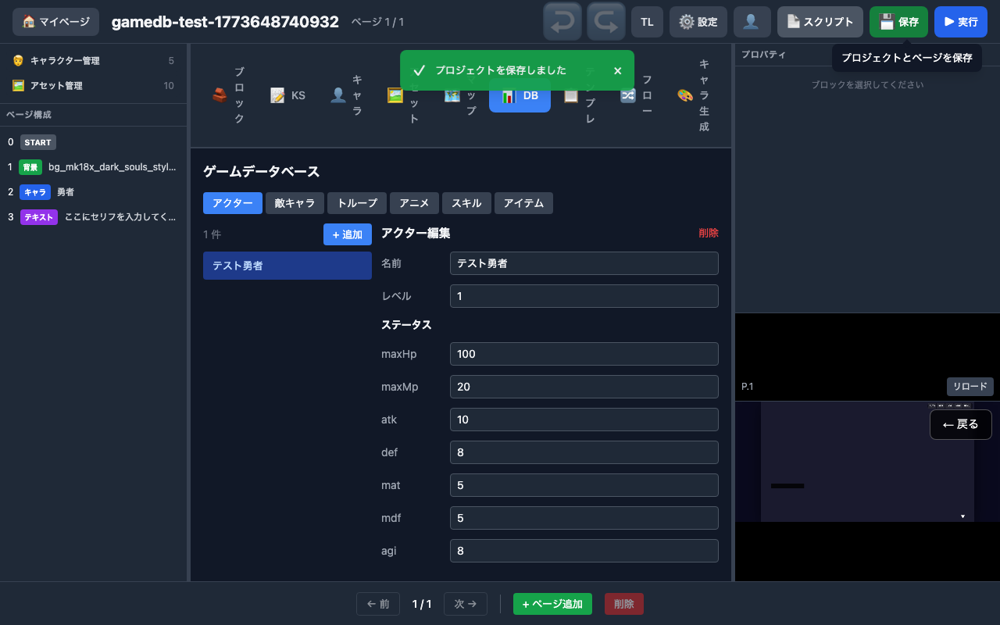

- DB タブ → アクターサブタブ → 「+ 追加」でアクター作成
- 名前・レベル・全8ステータス（maxHp/maxMp/atk/def/mat/mdf/agi/luk）を編集
- 保存後 API で値が保持されることを確認

### 敵キャラ編集
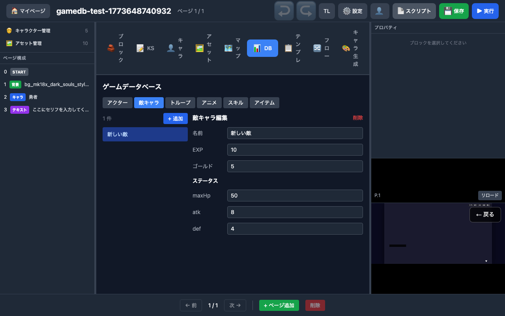

- 敵キャラサブタブ → 追加 → maxHp/atk/def の必須ステータスを設定

### スキル編集
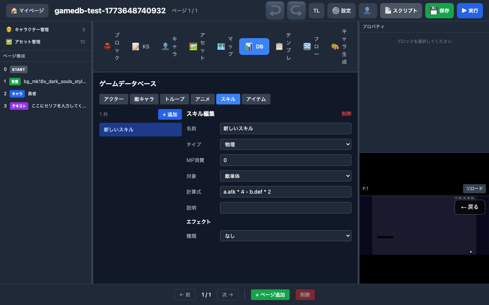

- スキルサブタブ → 追加 → 名前・種類・MP コスト・計算式・エフェクト設定

---

## 2. エディタ新ブロック

### call ブロック（テンプレート呼出）
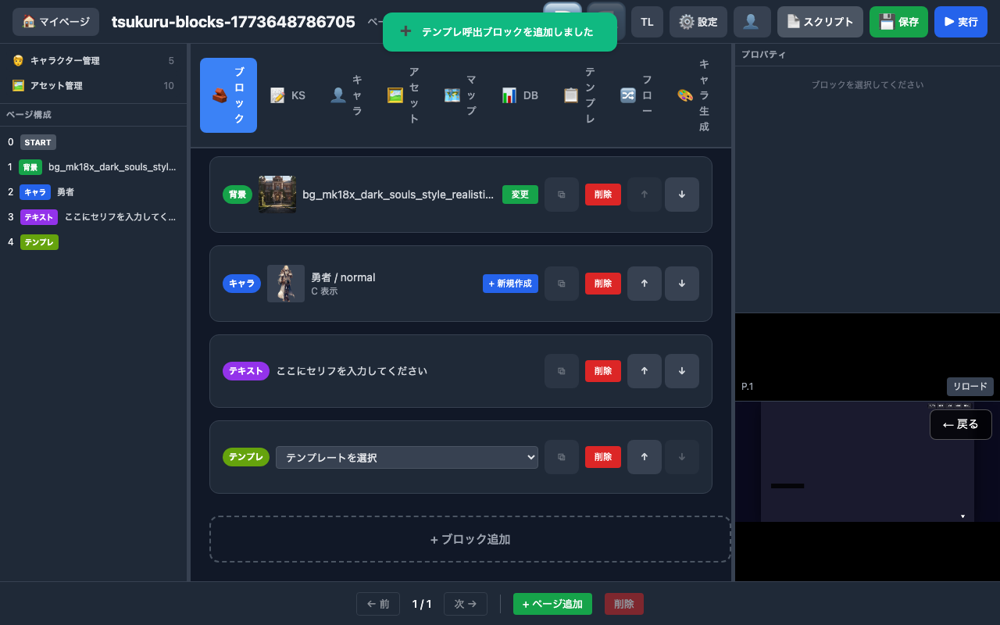

- ブロックパレットから「テンプレ」を選択して追加
- テンプレート選択ドロップダウンが表示される

### map_jump ブロック（マップ移動）
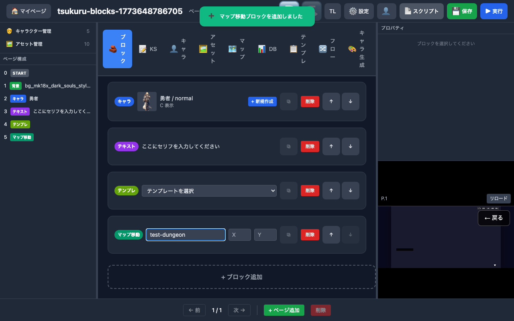

- マップ ID、スポーン座標（X/Y）を入力
- 保存後プロパティが保持される

### scroll_text ブロック（スクロールテキスト）
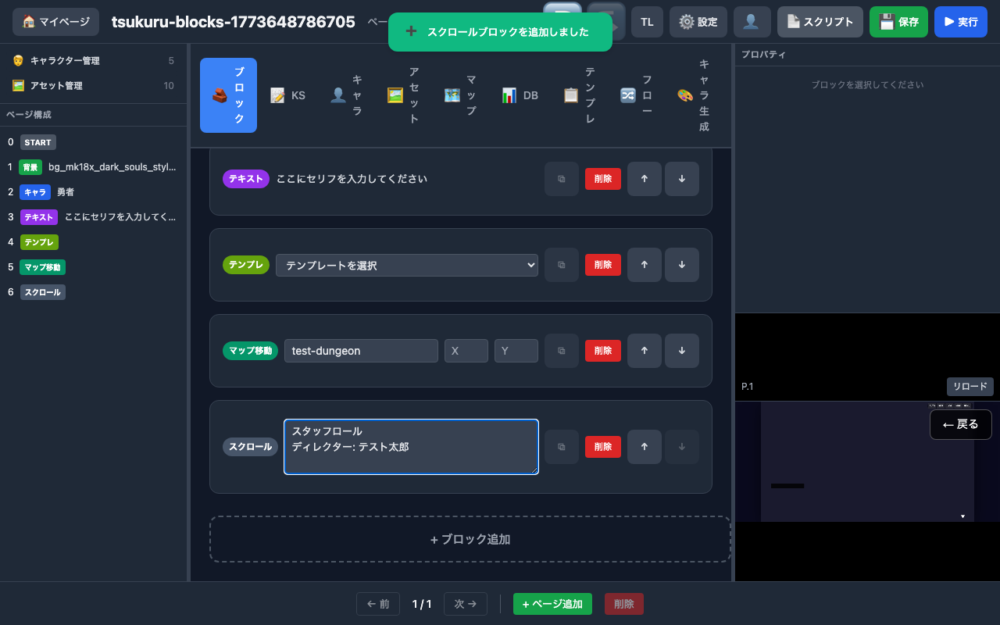

- テキストエリアにスタッフロール等を入力
- 保存後プロパティが保持される

---

## 3. テンプレート管理

### テンプレート追加
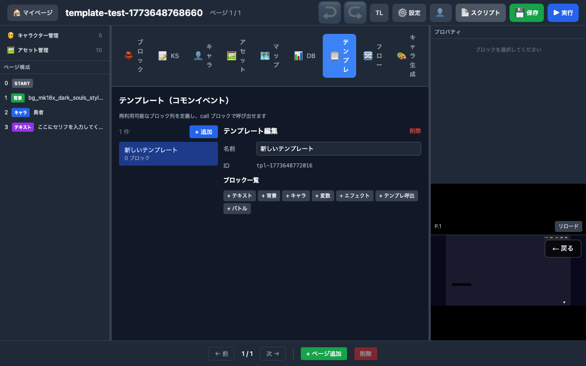

- テンプレタブ → 「+ 追加」でテンプレート作成
- テンプレート内にブロック追加が可能

### call ブロックからの選択

- call ブロックのドロップダウンに作成したテンプレートが表示される

---

## 4. バトル（gameDb 連携）

### カスタムアクター・敵でバトル
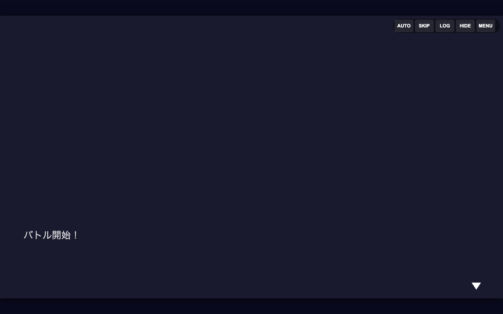

- API でプロジェクトに gameDb（カスタムアクター + 敵 + トループ）を設定
- プレビューで BATTLE_START が実行され、autoFight で自動完走
- gameDb なしの場合もフォールバック（デフォルト Hero）で動作

---

## 5. scroll_text プレビュー

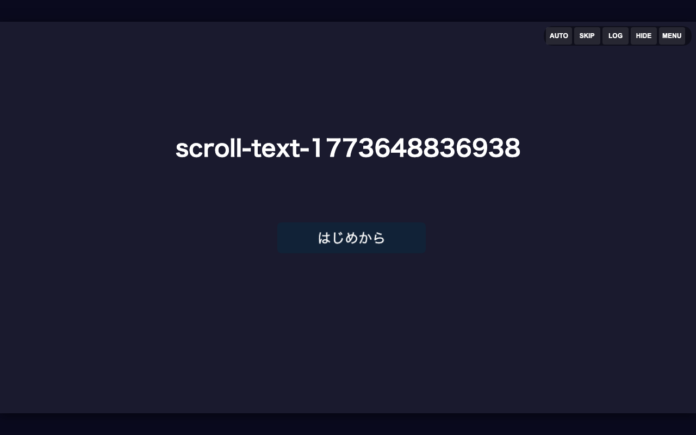

- scroll_text ブロック → プレビューで DOM オーバーレイ表示
- テキストが画面下から上へスクロール
- クリックでスキップ可能
- スキップ後にシナリオ続行

---

## 6. map_jump プレビュー

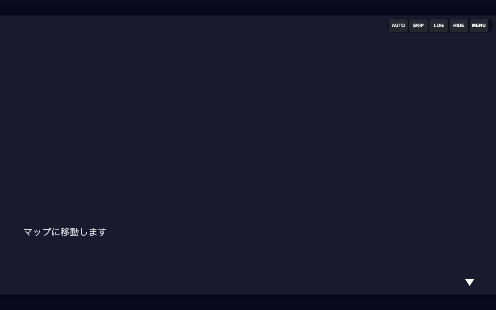

- map_jump ブロック → プレビューで MAP_LOAD Op が実行される
- コンソールログでマップ ID と座標を確認

---

## 7. アセット検索

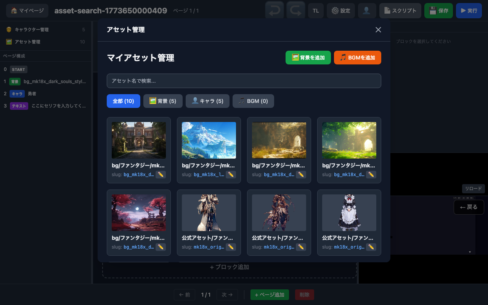

- アセットタブに検索ボックス追加
- 名前/slug/ID で部分一致フィルタ

---

## 8. マップシステム

### マップ管理画面
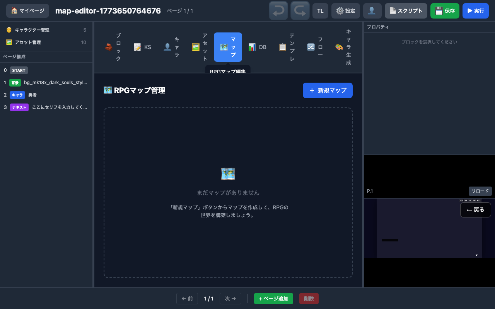

- マップタブ → RPGマップ管理画面
- 「+ 新規マップ」ボタンでマップ作成
- マップ一覧からクリックでマップエディタを開く

### マップ プレイ画面（ドット絵タイル描画）
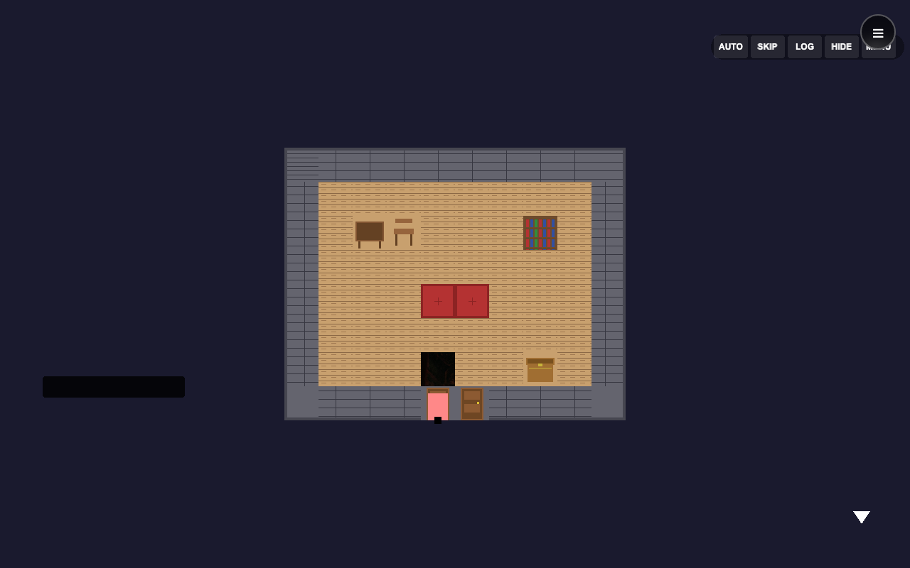

- PixiJS によるタイルベース描画（48x48px タイル）
- 室内マップ: 床・壁・家具（テーブル、棚、ソファ、宝箱）が配置
- プレイヤーキャラクター（ピンク）がマップ上を移動
- 衝突判定・イベント（ドア等）が動作
- クイックメニュー（AUTO/SKIP/LOG/HIDE/MENU）がオーバーレイ表示

### マップエディタの機能一覧

| 機能 | 状態 |
|------|:----:|
| タイル配置（ペンツール） | 実装済み |
| 消しゴムツール | 実装済み |
| バケツ塗り（フラッドフィル） | 実装済み |
| レイヤー切替（tile/collision/region） | 実装済み |
| グリッド表示 | 実装済み |
| Undo/Redo（最大20件） | 実装済み |
| マップリサイズ（5x5〜200x200） | 実装済み |
| タイルセット切替（室内/屋外/ダンジョン） | 実装済み |
| オートタイルパレット | 実装済み |
| テストプレイ（エディタ内） | 実装済み |
| エンカウント設定 | 実装済み |
| マップ接続設定 | 実装済み |

---

## 9. UI レイアウトエディタ

### エディタ全体（novel-standard）
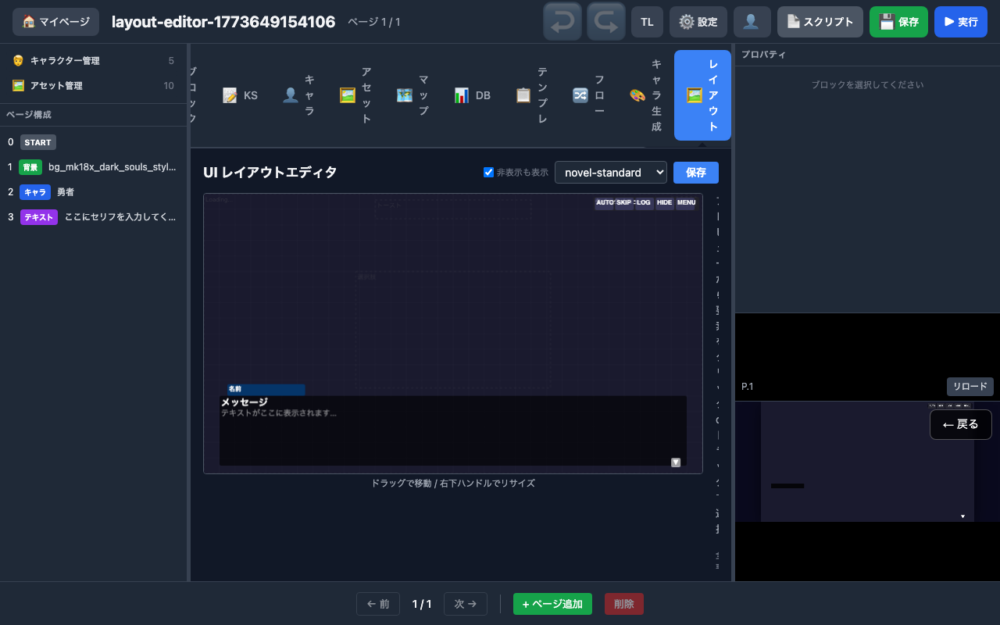

- 1280×720 プレビューキャンバス + グリッドガイド
- ドラッグで要素移動、右下ハンドルでリサイズ

### プリセット切替: rpg-classic
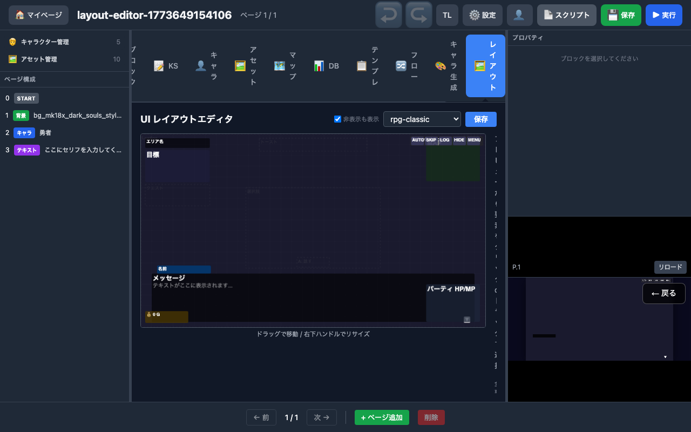

### プリセット切替: cinematic
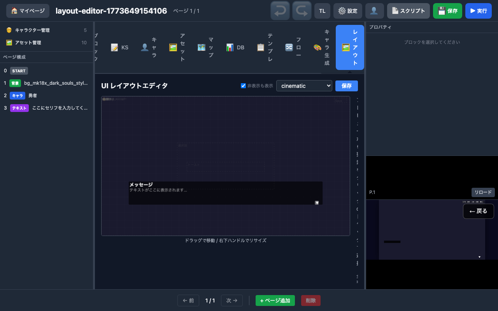

---

## 10. プレビュー動作

- 全ブロック（call/map_jump/scroll_text）を含むプロジェクトのプレビュー
- canvas が表示されクラッシュしないことを確認

---

## 11. テスト一覧（全 PASS）

| テストファイル | テスト数 | 内容 |
|-------------|:-------:|------|
| gamedb-editor.spec.ts | 5 | アクター/敵/スキル/アイテム CRUD + 削除 |
| tsukuru-blocks.spec.ts | 4 | call/map_jump/scroll_text 追加・保存・プレビュー |
| template-editor.spec.ts | 3 | テンプレート追加・ブロック追加・call 選択 |
| battle-gamedb.spec.ts | 2 | gameDb カスタム + フォールバック |
| battle-play.spec.ts | 1 | バトル実行・勝敗確認 |
| scroll-text.spec.ts | 1 | DOM オーバーレイ表示 |
| map-jump.spec.ts | 2 | MAP_LOAD + 座標検証 |
| layout-editor.spec.ts | 4 | タブ表示・プリセット・要素リスト・保存 |
| asset-search.spec.ts | 1 | 検索ボックス + 絞り込み |
| map-editor.spec.ts | 1 | マップタブ表示 + エディタ起動 |
| presets.test.ts | 32 | 10種プリセット構造検証 |
| **合計** | **56** | |
