# kaedevn エディタ ウォークスルーレポート

**実施日**: 2026-03-16
**テストファイル**: `tests/shared/flow/editor-walkthrough.spec.ts`
**結果**: 全18ステップ成功（41.2秒）

---

## フロー概要

ランディングページ → ログイン → マイページ → プロジェクト作成 → エディタ（全11タブ）→ プレビュー

---

## 1. ランディングページ

kaedevn BETA のトップページ。「ログインせずに始める」「ログイン」の2つのCTA、特徴セクション、3ステップガイド、最新作品一覧を表示。

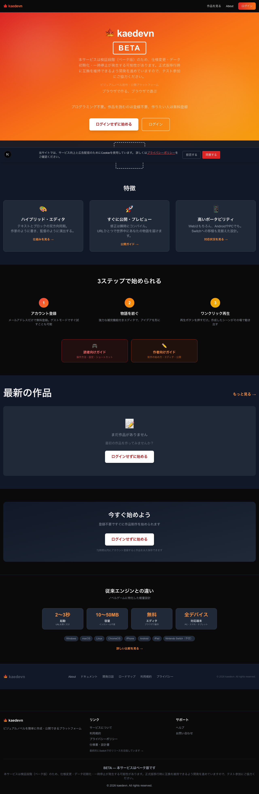

---

## 2. ログインページ

メールアドレスとパスワードの入力フォーム。

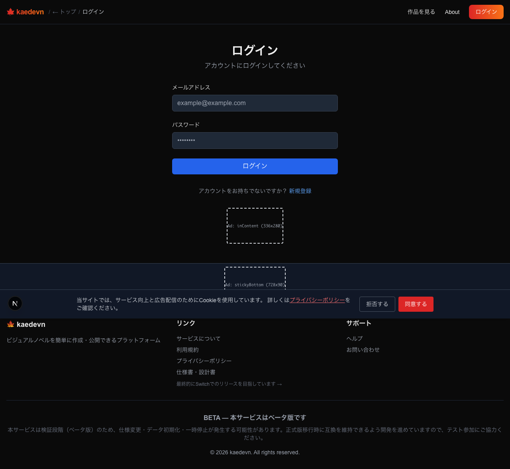

---

## 3. ログイン入力済み

テストアカウント（test1@example.com）でフォーム入力後の状態。

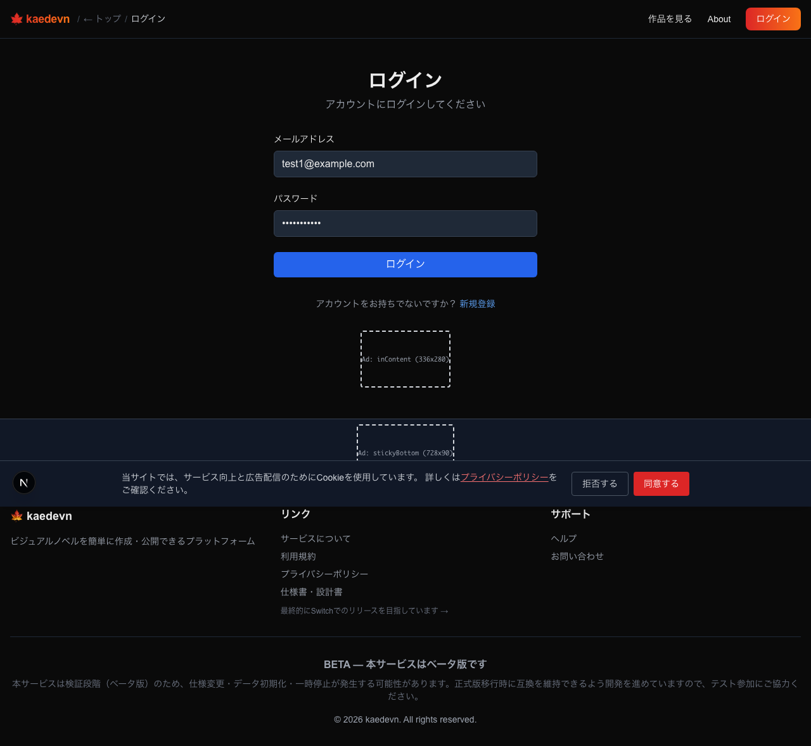

---

## 4. マイページ

ログイン後のダッシュボード。プロジェクト一覧が表示される。


---

## 5. マイページ（プロジェクト作成後）

API経由でプロジェクトを作成後、リロードして新規プロジェクトが表示された状態。


---

## 6. プロジェクト詳細ページ

個別プロジェクトのメタ情報。ここからエディタを開く。

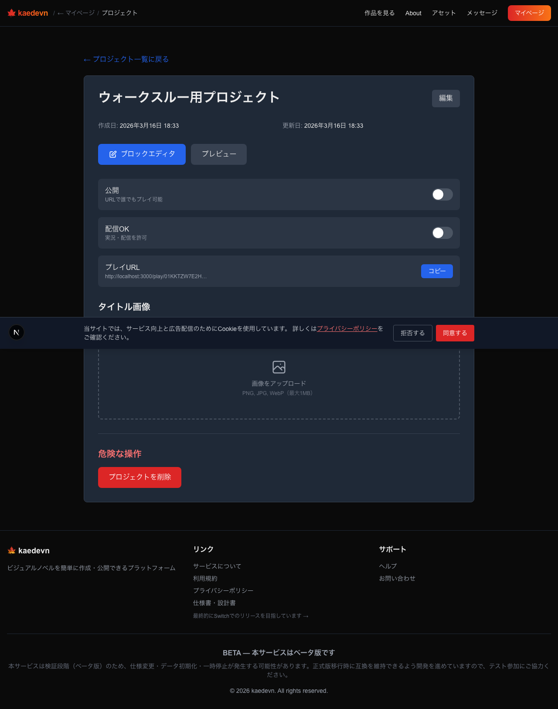

---

## 7. エディタ: ブロックタブ

メインの編集画面。ブロック一覧（START → 背景 → キャラ → テキスト）がサイドバーに表示され、右側にプレビューとプロパティパネル。

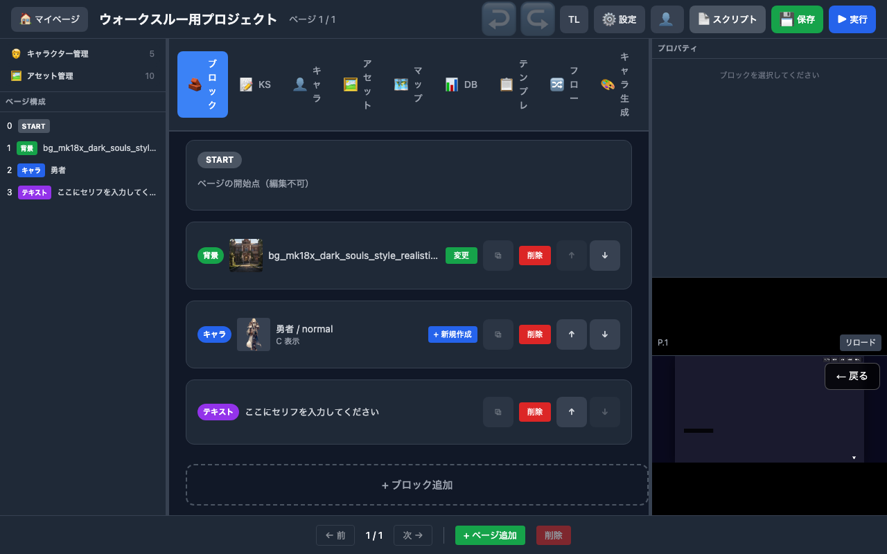

---

## 8. エディタ: KSタブ

KSスクリプトのテキスト編集。コンパイル済みスクリプトの直接編集が可能。

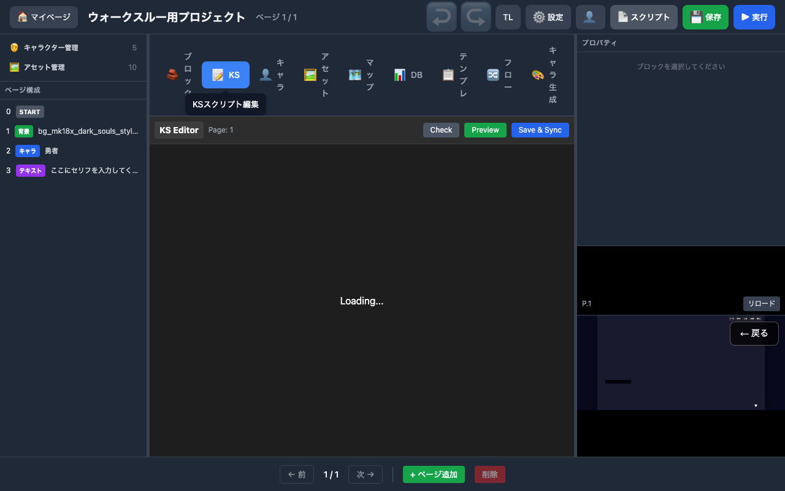

---

## 9. エディタ: キャラタブ

キャラクター一覧パネル。プロジェクトに登録されたキャラクターの表示・編集。

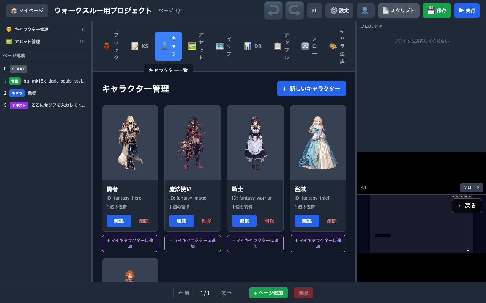

---

## 10. エディタ: アセットタブ

マイアセット管理。背景・キャラ・BGMのカテゴリ別表示、検索、アップロード機能。

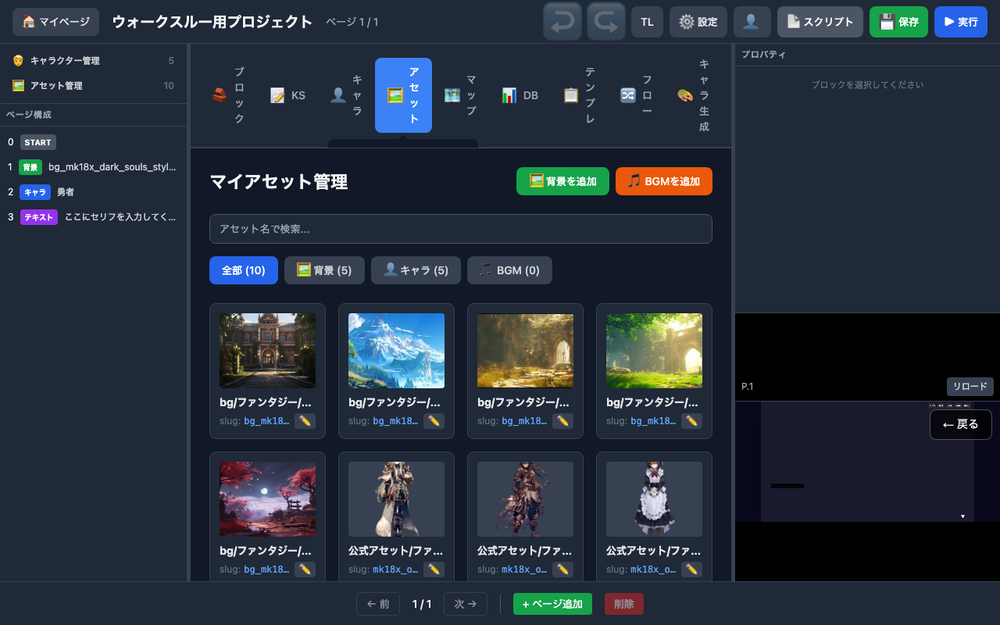

---

## 11. エディタ: マップタブ

RPGマップ管理。マップの新規作成、タイル配置、イベント設定（ツクール機能）。

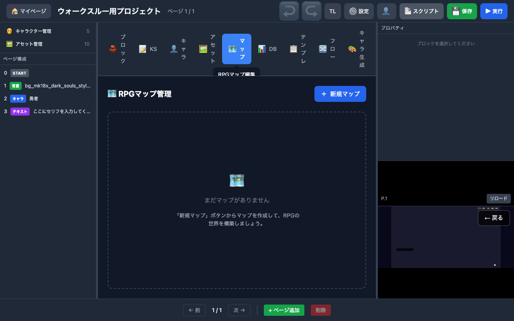

---

## 12. エディタ: DBタブ

ゲームデータベース。アクター・敵・スキル・アイテムのパラメータ管理（ツクール機能）。

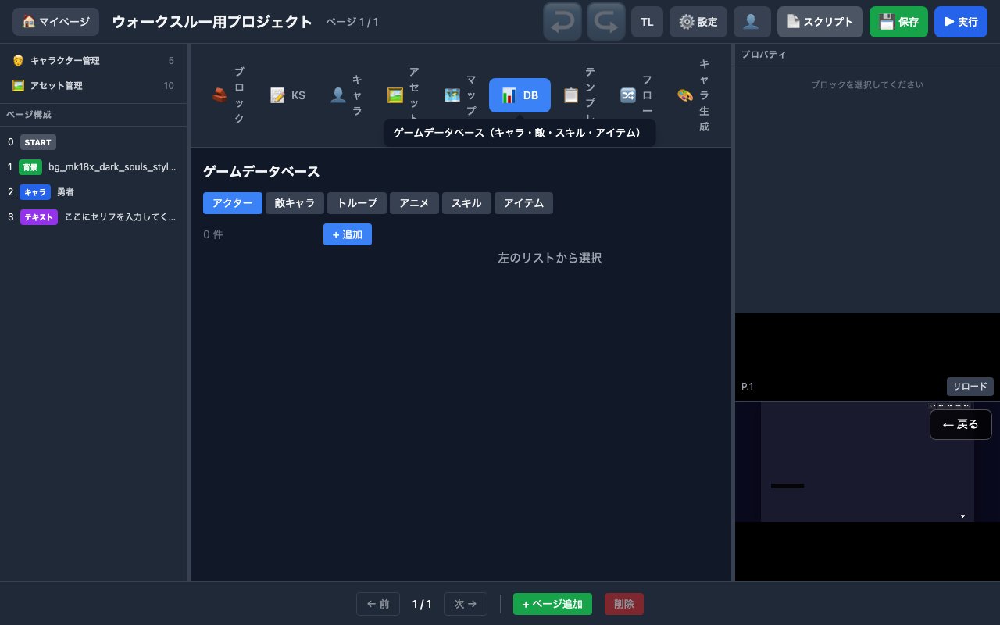

---

## 13. エディタ: テンプレタブ

テンプレート（コモンイベント）管理。再利用可能なブロックシーケンスの作成・編集（ツクール機能）。

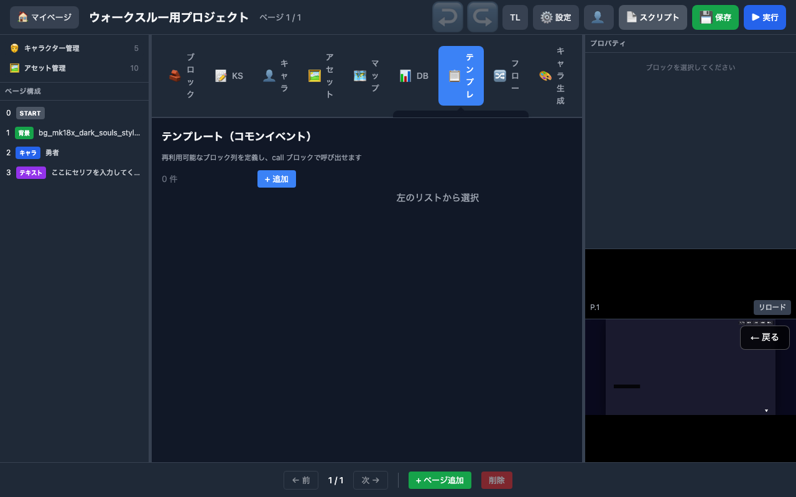

---

## 14. エディタ: フロータブ

シーンフロー。ページ間遷移のグラフ可視化。

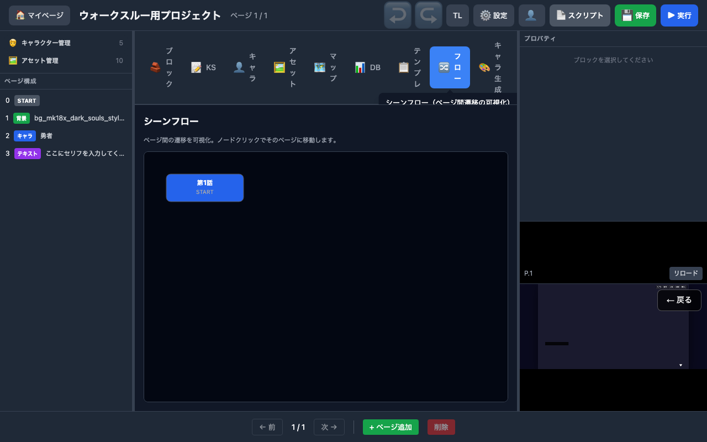

---

## 15. エディタ: キャラ生成タブ

キャラクター生成ツール。パーツ選択によるキャラクター画像生成（ツクール機能）。

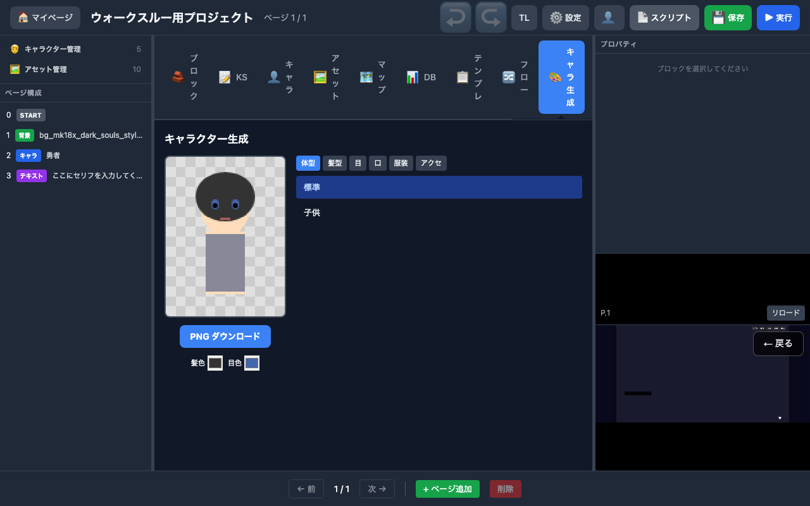

---

## 16. エディタ: レイアウトタブ

UIレイアウトエディタ。メッセージウィンドウ・名前表示・ボタンの位置・サイズをドラッグ操作で調整。10種のプリセット対応（ツクール機能）。

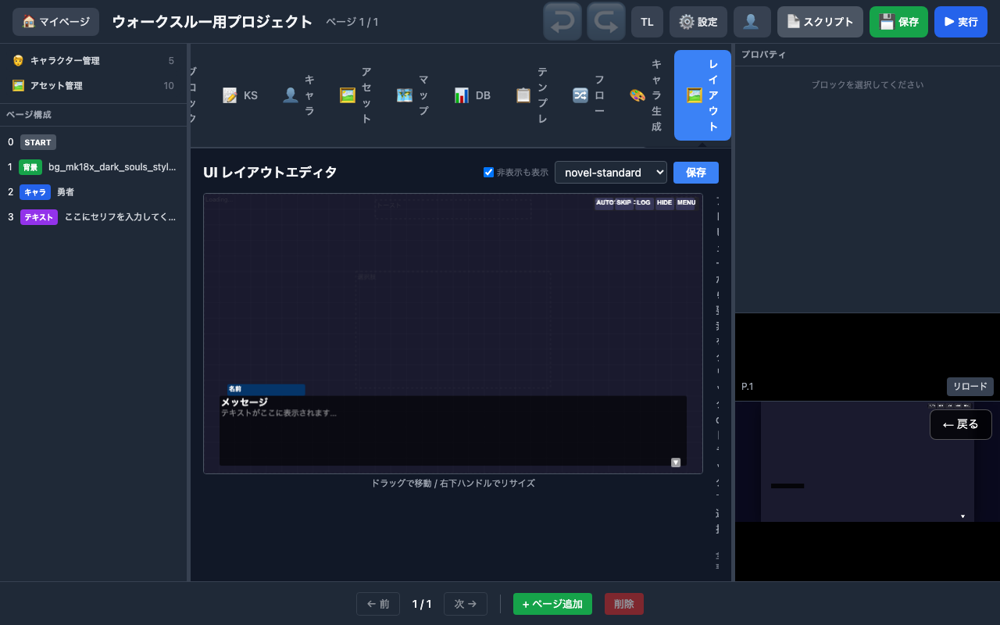

---

## 17. エディタ: 作品設定タブ

プロジェクトのタイトル・説明・メタ情報の設定。

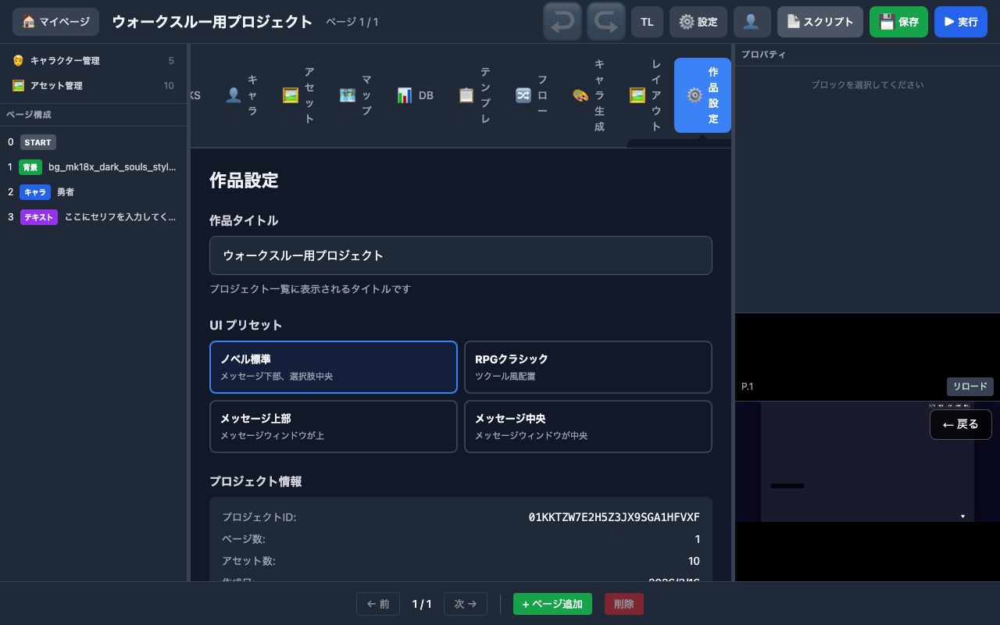

---

## 18. プレビュー

KSC エンジンによるリアルタイムプレビュー。背景・キャラクター・テキストが表示された状態。

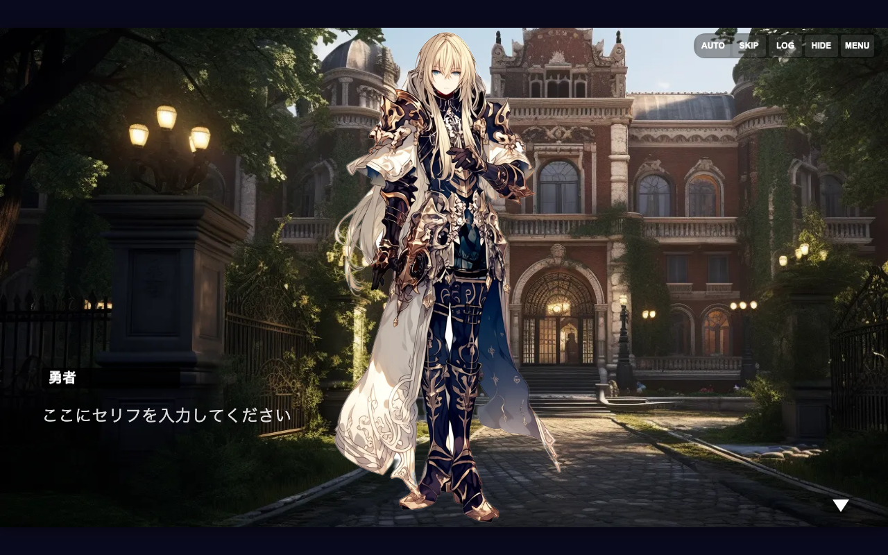

---

## テスト実行情報

| 項目 | 値 |
|------|-----|
| テストファイル | `tests/shared/flow/editor-walkthrough.spec.ts` |
| Playwright config | `tests/configs/playwright.local.config.ts` |
| ブラウザ | Chromium (headless) |
| 実行時間 | 41.2秒 |
| スクリーンショット数 | 18枚 |
| スキップ | なし |

### 実行コマンド

```bash
npx playwright test tests/shared/flow/editor-walkthrough.spec.ts \
  --config=tests/configs/playwright.local.config.ts
```
