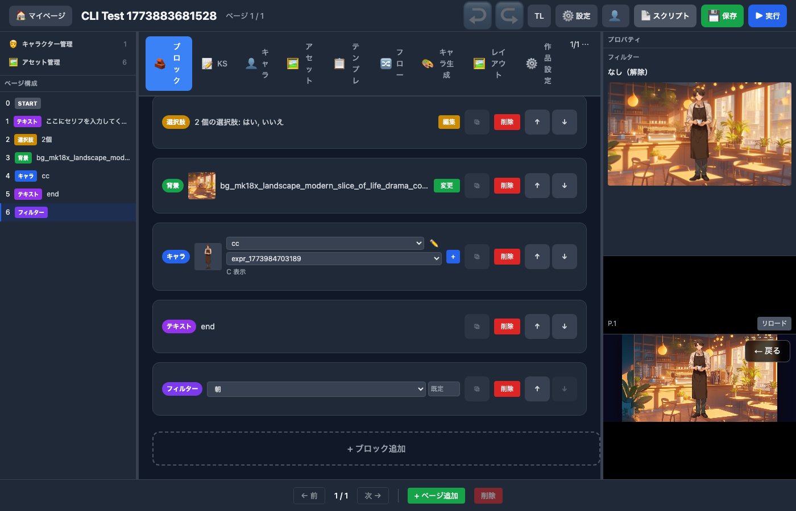
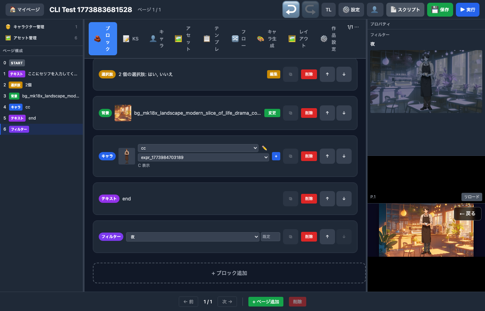
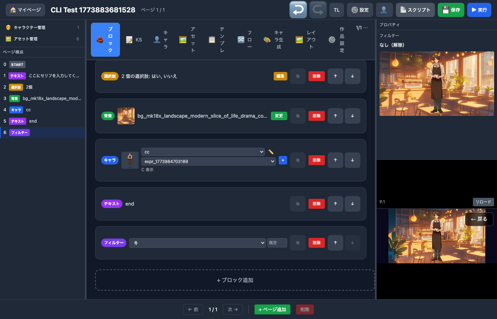

# 画面フィルター拡張仕様書 — 背景バリエーション特化

> Generated by Claude Opus 4.6

## 背景と目的

カクヨム・なろうの小説作者が、**キャラクターなし・背景画像＋フィルターだけ**でノベルゲームを作るユースケースを想定する。

素材として用意できる背景画像は限られている（教室・廊下・公園・自室 etc.）。しかしフィルターを使えば、1枚の「教室」画像から以下のバリエーションが作れる:

```
教室（昼）       → 教室の画像そのまま
教室（朝）       → @filter morning 0.6
教室（夕）       → @filter sunset 0.7
教室（夜の雨）   → @filter_mix night 0.5 rain 0.4
教室（回想）     → @filter nostalgia 0.5
教室（緊張の雪） → @filter_mix tense 0.6 snow 0.3
```

**1枚の背景 × フィルター単体・重ね掛けで数十パターンの場面が作れる。**

## 2つのブロック

### screen_filter（単体フィルター）— 既存拡張

**用途**: 1つのフィルターを適用する。使用頻度が最も高い。

```
┌──────────────────────────────────────────────┐
│ 🎨 [夕方 ▼]                          [0.7] │
└──────────────────────────────────────────────┘
```

- フィルター選択: ドロップダウン（カテゴリ別 `<optgroup>`）
- 強度: 数値入力（0.0〜1.0）
- 適用時に前のフィルターを**すべてクリア**して1つだけ適用
- **シンプルで迷わない。大半のシーンはこれで十分。**

#### KSC コマンド

```
@filter sunset 0.7          # 夕方フィルター適用（既存と同じ）
@filter night 0.5            # 夜フィルター適用（前のフィルターは自動解除）
@filter_clear                # フィルター全解除
```

#### ブロック型（既存そのまま）

```typescript
type ScreenFilterBlock = {
  id: string;
  type: 'screen_filter';
  filterType: string;
  intensity?: number;  // 0.0-1.0
};
```

---

### filter_mix（重ね掛けフィルター）— 新規

**用途**: 複数フィルターを重ねて、より具体的な場面を作る。

```
┌──────────────────────────────────────────────────────────┐
│ 🎨🎨 重ね掛け                                            │
│  ① [夜 ▼]     [0.5]                                     │
│  ② [雨 ▼]     [0.4]                                     │
│  ③ [哀愁 ▼]   [0.3]                            [＋][－] │
└──────────────────────────────────────────────────────────┘
```

- フィルターを2〜4層まで重ねられる
- 各層にドロップダウン + 数値入力
- [＋] で層を追加、[－] で最後の層を削除
- 適用時に前のフィルターを**すべてクリア**してから重ね掛け適用

#### KSC コマンド

```
@filter_mix night 0.5 rain 0.4                    # 夜 + 雨
@filter_mix night 0.5 rain 0.4 melancholy 0.3     # 夜 + 雨 + 哀愁
@filter_clear                                      # 全解除（共通）
```

#### ブロック型（新規）

```typescript
type FilterMixBlock = {
  id: string;
  type: 'filter_mix';
  layers: Array<{
    filterType: string;
    intensity?: number;  // 0.0-1.0
  }>;
};
```

---

### 2つのブロックの使い分け

| 場面 | ブロック | 例 |
|------|---------|-----|
| 教室を夕方にしたい | `screen_filter` | `@filter sunset 0.7` |
| 教室を朝にしたい | `screen_filter` | `@filter morning 0.5` |
| 雨の夜の教室にしたい | `filter_mix` | `@filter_mix night 0.5 rain 0.4` |
| 雪の中の告白（ロマンチック） | `filter_mix` | `@filter_mix snow 0.3 romantic 0.4` |
| 回想の中の嵐 | `filter_mix` | `@filter_mix nostalgia 0.5 storm 0.3` |
| 単に暗くしたい | `screen_filter` | `@filter dark 0.5` |

**作者の8割は `screen_filter` だけで済む。凝りたい場面でだけ `filter_mix` を使う。**

---

## 重ね掛けのパフォーマンス設計

### レイヤー分類

| 分類 | 処理方式 | コスト | フィルター |
|------|---------|--------|-----------|
| **色調系** | ColorMatrix 行列積 → 1パスに合成 | ほぼゼロ | sepia, grayscale, desaturate, warm, cool, vivid, muted, bright, dark, morning, sunset, twilight, moonlight, autumn, winter, peaceful, tense, melancholy |
| **ポスト処理系** | 独立シェーダー → 1パス追加 | 軽い | vignette, bloom, focusBlur, nostalgia, romantic, dreamy, horror, mysterious |
| **天候・パーティクル系** | アニメーション付きシェーダー → 1パス追加 | やや重い | rain, snow, fog, overcast, storm, sunbeam, sakura, summer |

### 合成ルール

```
重ね掛け時の処理:
1. 色調系を全て ColorMatrix に合成 → stage.filters に1つだけ追加（0コスト）
2. ポスト処理系があれば1つだけ追加（1パス）
3. 天候系があれば1つだけ追加（1パス）

→ 最大でも 3パス。Switch でも安全。
```

#### 制約

- **色調系**: 何枚でも重ね可
- **ポスト処理系**: 最大1つ（2つ目を追加したら前のを上書き）
- **天候・パーティクル系**: 最大1つ（同上）

UI でこの制約を超えた場合、警告を表示:
```
⚠ 天候フィルターは1つまでです。「雨」を「雪」に置き換えます。
```

---

## 設計方針

- **UI は最小限** — ドロップダウン + 数値入力（0.0〜1.0）のみ。スライダーや詳細パラメータ UI は作らない
- **フィルター種類で勝負** — パラメータの細かい調整ではなく、「選ぶだけで使える」プリセットを充実させる
- intensity 1つで効果の強さを制御。0.0 で効果なし、1.0 で最大
- **小説作者が名前を見ただけでわかるラベル** — 技術用語ではなく場面表現

## フィルター一覧

### 時間帯（Time of Day）

背景画像の「何時の場面か」を変える。最も使用頻度が高い。

| ID | ラベル | 合成分類 | 効果 | intensity の意味 |
|----|-------|---------|------|-----------------|
| `morning` | 朝 | 色調 | 暖色オレンジ + 明るさアップ + 薄いゴッドレイ | 0.0=かすか → 1.0=朝焼け |
| `sunset` | 夕方 | 色調 | 強いオレンジ + やや暗め + 高彩度 | 0.0=午後 → 1.0=真っ赤な夕焼け |
| `twilight` | 黄昏 | 色調 | 紫〜オレンジのグラデーション + 暗め | 0.0=薄暮 → 1.0=深い黄昏 |
| `night` | 夜 | 色調 | 青みがかった暗さ | 0.0=宵 → 1.0=深夜 |
| `moonlight` | 月明かり | 色調 | 青白い光 + 暗め + 微かな輝き | 0.0=薄い → 1.0=煌々 |

### 天候（Weather）

背景画像に天気を加える。アニメーション付き。

| ID | ラベル | 合成分類 | 効果 | intensity の意味 |
|----|-------|---------|------|-----------------|
| `rain` | 雨 | 天候 | 雨粒 + やや暗め（既存） | 0.0=霧雨 → 1.0=豪雨 |
| `snow` | 雪 | 天候 | 雪粒子 + 明るめ + わずかな白い霧 | 0.0=粉雪 → 1.0=吹雪 |
| `fog` | 霧 | 天候 | 白い靄 + コントラスト低下 | 0.0=薄霧 → 1.0=濃霧 |
| `overcast` | 曇り | 色調 | 彩度低下 + やや暗め + コントラスト低下 | 0.0=薄曇 → 1.0=どんより |
| `storm` | 嵐 | 天候 | 暗さ + 雨 + 稲光フラッシュ（ランダム） | 0.0=荒天 → 1.0=暴風雨 |
| `sunbeam` | 木漏れ日 | 天候 | 明るい光の筋 + 暖色 + ちらちら揺れ | 0.0=かすか → 1.0=まぶしい |

### 季節感（Season）

背景に季節の空気感を加える。

| ID | ラベル | 合成分類 | 効果 | intensity の意味 |
|----|-------|---------|------|-----------------|
| `sakura` | 桜 | 天候 | 花びら + ピンクの色調 | 0.0=散り際 → 1.0=満開の嵐 |
| `autumn` | 紅葉 | 色調 | 暖色の色調（赤・黄）+ わずかに彩度アップ | 0.0=初秋 → 1.0=紅葉真っ盛り |
| `summer` | 真夏 | 天候 | 高コントラスト + 明るさ + 陽炎ゆらぎ | 0.0=初夏 → 1.0=灼熱 |
| `winter` | 冬 | 色調 | 寒色 + 低彩度 + わずかな白い靄 | 0.0=晩秋 → 1.0=厳冬 |

### 雰囲気・感情（Mood）

場面の感情・空気感を演出する。小説のシーンに合わせて使う。

| ID | ラベル | 合成分類 | 効果 | intensity の意味 |
|----|-------|---------|------|-----------------|
| `dreamy` | ほんわか | ポスト処理 | ソフトフォーカス + 明るさ + 高彩度 | 0.0=ふんわり → 1.0=幻想的 |
| `tense` | 緊張 | 色調 | 低彩度 + わずかな暗さ + 微かな周辺減光 | 0.0=不穏 → 1.0=重圧 |
| `melancholy` | 哀愁 | 色調 | 青み + 低彩度 + 暗め | 0.0=物悲しい → 1.0=絶望的 |
| `nostalgia` | 懐かしい | ポスト処理 | セピア + ソフトフォーカス + 周辺減光 | 0.0=ほのか → 1.0=遠い記憶 |
| `romantic` | ロマンチック | ポスト処理 | ピンク色調 + ソフトフォーカス + ブルーム | 0.0=甘い → 1.0=夢見心地 |
| `horror` | ホラー | ポスト処理 | 暗さ + 低彩度 + ノイズ + 周辺減光 | 0.0=不気味 → 1.0=恐怖 |
| `mysterious` | ミステリアス | ポスト処理 | 紫色調 + 暗め + ブルーム | 0.0=怪しい → 1.0=異界 |
| `peaceful` | 穏やか | 色調 | 暖色 + やや明るめ + 低コントラスト | 0.0=のどか → 1.0=至福 |

### 色調補正（Tone）

背景の色味だけを変える。シンプルだが汎用性が高い。

| ID | ラベル | 合成分類 | 効果 | intensity の意味 |
|----|-------|---------|------|-----------------|
| `sepia` | セピア | 色調 | セピア色（既存） | 0.0=薄い → 1.0=完全 |
| `grayscale` | モノクロ | 色調 | 白黒（既存） | 0.0=薄い → 1.0=完全 |
| `desaturate` | 色褪せ | 色調 | 彩度低下 | 0.0=わずか → 1.0=ほぼモノクロ |
| `warm` | 暖色 | 色調 | 暖かい色調（オレンジ寄り） | 0.0=ほのか → 1.0=強い |
| `cool` | 寒色 | 色調 | 冷たい色調（青寄り） | 0.0=ほのか → 1.0=強い |
| `vivid` | 鮮やか | 色調 | 彩度・コントラスト アップ | 0.0=やや → 1.0=ビビッド |
| `muted` | くすみ | 色調 | 彩度ダウン + 明度ダウン | 0.0=わずか → 1.0=重い |
| `bright` | 明るく | 色調 | 明度アップ + わずかにコントラスト上げ | 0.0=やや → 1.0=眩しい |
| `dark` | 暗く | 色調 | 明度ダウン | 0.0=やや → 1.0=真っ暗 |

### 特殊演出（Effect）

ここぞという場面で使う。

| ID | ラベル | 合成分類 | 効果 | intensity の意味 |
|----|-------|---------|------|-----------------|
| `blur` | ぼかし | ポスト処理 | 全体ぼかし（既存） | 0.0=微か → 1.0=強い |
| `vignette` | 周辺暗転 | ポスト処理 | 画面端の暗さ（既存） | 0.0=微か → 1.0=強い |
| `focusBlur` | 中央フォーカス | ポスト処理 | 周辺ぼかし（既存） | 0.0=微か → 1.0=強い |
| `noise` | ノイズ | ポスト処理 | フィルムノイズ（既存） | 0.0=微か → 1.0=強い |
| `glitch` | グリッチ | ポスト処理 | デジタルノイズ（既存） | 0.0=微か → 1.0=強い |
| `chromaticAberration` | 色ずれ | ポスト処理 | 色収差（既存） | 0.0=微か → 1.0=強い |
| `oldFilm` | 古いフィルム | ポスト処理 | セピア + ノイズ + 傷（既存） | 0.0=微か → 1.0=強い |

### レトロ（Retro）

特殊な世界観向け。

| ID | ラベル | 合成分類 | 効果 |
|----|-------|---------|------|
| `pc98` | PC-98（既存） | ポスト処理 | ディザリング |
| `gameboy` | ゲームボーイ（既存） | ポスト処理 | 4色パレット |
| `crt` | CRT（既存） | ポスト処理 | 走査線 |
| `pixelate` | ドット絵（既存） | ポスト処理 | ピクセル化 |

## フィルター合計

| カテゴリ | 既存 | 新規 | 計 |
|---------|------|------|---|
| 時間帯 | 1 (night) | 4 (morning, sunset, twilight, moonlight) | 5 |
| 天候 | 1 (rain) | 5 (snow, fog, overcast, storm, sunbeam) | 6 |
| 季節感 | 0 | 4 (sakura, autumn, summer, winter) | 4 |
| 雰囲気 | 0 | 8 (dreamy, tense, melancholy, nostalgia, romantic, horror, mysterious, peaceful) | 8 |
| 色調 | 2 (sepia, grayscale) | 7 (desaturate, warm, cool, vivid, muted, bright, dark) | 9 |
| 特殊演出 | 7 | 0 | 7 |
| レトロ | 4 | 0 | 4 |
| **合計** | **15** | **28** | **43** |

## 使用例（小説シーン × フィルター）

### 例1: 学園ラブコメ（背景3枚で全話カバー）

| シーン | 背景 | ブロック | コマンド |
|--------|------|---------|---------|
| 朝のHR | 教室 | screen_filter | `@filter morning 0.5` |
| 昼休み | 教室 | — | なし |
| 放課後告白 | 教室 | screen_filter | `@filter sunset 0.8` |
| 夜の自習 | 教室 | screen_filter | `@filter night 0.5` |
| 屋上（雨） | 屋上 | screen_filter | `@filter rain 0.5` |
| 回想 | 教室 | screen_filter | `@filter nostalgia 0.6` |
| デート | 公園 | screen_filter | `@filter romantic 0.4` |
| 雨の中の告白 | 屋上 | **filter_mix** | `@filter_mix sunset 0.6 rain 0.3` |
| 雪のクリスマス | 公園 | **filter_mix** | `@filter_mix night 0.4 snow 0.5 romantic 0.3` |

→ **背景3枚 × フィルターで 9+ 場面**

### 例2: ホラー小説（背景2枚で全話カバー）

| シーン | 背景 | ブロック | コマンド |
|--------|------|---------|---------|
| 夜の学校 | 廊下 | screen_filter | `@filter night 0.7` |
| 異変 | 廊下 | screen_filter | `@filter horror 0.5` |
| 追跡 | 廊下 | **filter_mix** | `@filter_mix horror 0.8 glitch 0.3` |
| 霧の中 | 外 | screen_filter | `@filter fog 0.7` |
| 雷雨の異界 | 外 | **filter_mix** | `@filter_mix storm 0.6 mysterious 0.7` |
| 日常パート | 廊下 | screen_filter | `@filter peaceful 0.3` |

### 例3: ファンタジー小説（背景4枚で全話カバー）

| シーン | 背景 | ブロック | コマンド |
|--------|------|---------|---------|
| 冒険の始まり | 草原 | screen_filter | `@filter morning 0.6` |
| 旅の途中 | 森 | screen_filter | `@filter sunbeam 0.5` |
| 雪山 | 山道 | **filter_mix** | `@filter_mix snow 0.5 winter 0.6` |
| 砂漠 | 荒野 | screen_filter | `@filter summer 0.7` |
| 暗い洞窟 | 室内 | **filter_mix** | `@filter_mix dark 0.7 mysterious 0.4` |
| ボス戦前 | 城 | **filter_mix** | `@filter_mix tense 0.8 dark 0.3` |
| 回想 | 草原 | screen_filter | `@filter nostalgia 0.5` |
| エンディング | 草原 | **filter_mix** | `@filter_mix sunset 0.7 dreamy 0.3` |

## UI 仕様

### screen_filter ブロックカード（既存拡張）

```
┌──────────────────────────────────────────────┐
│ 🎨 [夕方 ▼]                          [0.7] │
└──────────────────────────────────────────────┘
```

- ドロップダウン: カテゴリ別 `<optgroup>` で分類
- 数値入力: `<input type="number" min=0 max=1 step=0.1>`
- 既存 UI と同じ形式。新フィルターが選択肢に増えるだけ

### filter_mix ブロックカード（新規）

```
┌──────────────────────────────────────────────────────────┐
│ 🎨🎨 重ね掛け                                            │
│  ① [夜 ▼]     [0.5]                                     │
│  ② [雨 ▼]     [0.4]                                     │
│                                                [＋] [－] │
└──────────────────────────────────────────────────────────┘
```

- 初期状態: 2層
- [＋] で層追加（最大4層）
- [－] で最後の層を削除（最小2層）
- 各層のドロップダウン・数値入力は screen_filter と同じ形式
- 同じ合成分類のフィルターが制約を超えた場合は警告表示

### ドロップダウンの表示（両ブロック共通）

```
┌─────────────────────┐
│ なし（解除）         │
├─────────────────────┤
│ ◆ 時間帯            │
│   朝                 │
│   夕方               │
│   黄昏               │
│   夜                 │
│   月明かり           │
├─────────────────────┤
│ ◆ 天候              │
│   雨                 │
│   雪                 │
│   霧                 │
│   曇り               │
│   嵐                 │
│   木漏れ日           │
├─────────────────────┤
│ ◆ 季節感            │
│   桜                 │
│   紅葉               │
│   真夏               │
│   冬                 │
├─────────────────────┤
│ ◆ 雰囲気            │
│   ほんわか           │
│   緊張               │
│   哀愁               │
│   懐かしい           │
│   ロマンチック       │
│   ホラー             │
│   ミステリアス       │
│   穏やか             │
├─────────────────────┤
│ ◆ 色調              │
│   セピア             │
│   モノクロ           │
│   色褪せ             │
│   暖色               │
│   寒色               │
│   鮮やか             │
│   くすみ             │
│   明るく             │
│   暗く               │
├─────────────────────┤
│ ◆ 特殊演出          │
│   ぼかし             │
│   周辺暗転           │
│   中央フォーカス     │
│   ノイズ             │
│   グリッチ           │
│   色ずれ             │
│   古いフィルム       │
├─────────────────────┤
│ ◆ レトロ            │
│   PC-98              │
│   ゲームボーイ       │
│   CRT                │
│   ドット絵           │
└─────────────────────┘
```

## 変更ファイル一覧

| # | ファイル | 変更 |
|---|---------|------|
| 1 | `apps/editor/src/types/index.ts` | FilterMixBlock 型追加 |
| 2 | `apps/editor/src/components/blocks/ScreenFilterBlockCard.tsx` | カテゴリ再編、新フィルター選択肢追加 |
| 3 | `apps/editor/src/components/blocks/FilterMixBlockCard.tsx` | 新規: 重ね掛けブロック UI |
| 4 | `packages/core/src/types/Op.ts` | FILTER_MIX Op 追加 |
| 5 | `packages/compiler/src/registry/commandRegistry.ts` | @filter_mix コマンド追加 |
| 6 | `packages/web/src/renderer/ScreenFilter.ts` | FilterType 拡張 + applyMix() メソッド追加 |
| 7 | `packages/web/src/renderer/filters/MorningFilter.ts` | 新規 |
| 8 | `packages/web/src/renderer/filters/SunsetFilter.ts` | 新規 |
| 9 | `packages/web/src/renderer/filters/TwilightFilter.ts` | 新規 |
| 10 | `packages/web/src/renderer/filters/MoonlightFilter.ts` | 新規 |
| 11 | `packages/web/src/renderer/filters/SnowFilter.ts` | 新規 |
| 12 | `packages/web/src/renderer/filters/FogFilter.ts` | 新規 |
| 13 | `packages/web/src/renderer/filters/OvercastFilter.ts` | 新規 |
| 14 | `packages/web/src/renderer/filters/StormFilter.ts` | 新規 |
| 15 | `packages/web/src/renderer/filters/SunbeamFilter.ts` | 新規 |
| 16 | `packages/web/src/renderer/filters/SakuraFilter.ts` | 新規 |
| 17 | `packages/web/src/renderer/filters/AutumnFilter.ts` | 新規 |
| 18 | `packages/web/src/renderer/filters/SummerFilter.ts` | 新規 |
| 19 | `packages/web/src/renderer/filters/WinterFilter.ts` | 新規 |
| 20 | `packages/web/src/renderer/filters/DreamyFilter.ts` | 新規 |
| 21 | `packages/web/src/renderer/filters/TenseFilter.ts` | 新規 |
| 22 | `packages/web/src/renderer/filters/MelancholyFilter.ts` | 新規 |
| 23 | `packages/web/src/renderer/filters/NostalgiaFilter.ts` | 新規 |
| 24 | `packages/web/src/renderer/filters/RomanticFilter.ts` | 新規 |
| 25 | `packages/web/src/renderer/filters/HorrorFilter.ts` | 新規 |
| 26 | `packages/web/src/renderer/filters/MysteriousFilter.ts` | 新規 |
| 27 | `packages/web/src/renderer/filters/PeacefulFilter.ts` | 新規 |
| 28 | `packages/web/src/renderer/filters/DesaturateFilter.ts` | 新規 |
| 29 | `packages/web/src/renderer/filters/WarmFilter.ts` | 新規 |
| 30 | `packages/web/src/renderer/filters/CoolFilter.ts` | 新規 |
| 31 | `packages/web/src/renderer/filters/VividFilter.ts` | 新規 |
| 32 | `packages/web/src/renderer/filters/MutedFilter.ts` | 新規 |
| 33 | `packages/web/src/renderer/filters/BrightFilter.ts` | 新規 |
| 34 | `packages/web/src/renderer/filters/DarkFilter.ts` | 新規 |
| 35 | `apps/hono/src/lib/editor-schema.ts` | filter_mix ブロック定義 + enum 更新 |
| 36 | `apps/editor/src/store/useEditorStore.ts` | filter_mix の getBlockScript / buildSnapshotScript |
| 37 | `packages/web/src/engine/IOpHandler.ts` | filterMix ハンドラ追加 |
| 38 | `packages/web/src/engine/OpRunner.ts` | FILTER_MIX dispatch 追加 |
| 39 | `packages/web/src/engine/WebOpHandler.ts` | filterMix 実装 |

## 実装優先度

| Phase | 内容 | 詳細 |
|-------|------|------|
| **Phase 1** | screen_filter に新フィルター追加（色調系） | desaturate, warm, cool, vivid, muted, bright, dark — ColorMatrix のみ、GLSL 不要 |
| **Phase 2** | screen_filter に新フィルター追加（時間帯・雰囲気） | morning, sunset, twilight, moonlight, tense, melancholy, peaceful, overcast, autumn, winter — ColorMatrix 組み合わせ |
| **Phase 3** | screen_filter に新フィルター追加（ポスト処理系） | dreamy, nostalgia, romantic, horror, mysterious — 既存フィルターの合成 |
| **Phase 4** | filter_mix ブロック実装 | 新ブロック型 + UI + コマンド + エンジン対応 |
| **Phase 5** | 天候・季節アニメーション | snow, fog, storm, sunbeam, sakura, summer — GLSL 新規実装 |

Phase 1〜3 は既存の PixiJS ColorMatrixFilter と既存カスタムフィルターの組み合わせで実装できるため、GLSL を新規に書く必要がない。Phase 4 は UI + エンジン変更だが、フィルター自体は Phase 1〜3 のものを流用。Phase 5 が最も工数が大きい。

---

## フィルターサンプル画像

エディタ上で各フィルターを適用した際のスクリーンショット。すべて同一背景に対して intensity デフォルト値で適用。

### フィルターなし（ベースライン）


### 時間帯（Time of Day）

| フィルター | スクリーンショット |
|-----------|-------------------|
| morning（朝） |  |
| sunset（夕方） |  |
| twilight（黄昏） |  |
| night（夜） |  |
| moonlight（月明かり） |  |

### 雰囲気・感情（Mood）

| フィルター | スクリーンショット |
|-----------|-------------------|
| dreamy（ほんわか） |  |
| tense（緊張） |  |
| melancholy（哀愁） |  |
| nostalgia（懐かしい） |  |
| romantic（ロマンチック） |  |
| horror（ホラー） |  |
| mysterious（ミステリアス） |  |
| peaceful（穏やか） |  |

### 色調補正（Tone）

| フィルター | スクリーンショット |
|-----------|-------------------|
| desaturate（色褪せ） |  |
| warm（暖色） |  |
| cool（寒色） |  |
| vivid（鮮やか） |  |
| muted（くすみ） |  |
| bright（明るく） |  |
| dark（暗く） |  |

### 天候（Weather）

| フィルター | スクリーンショット |
|-----------|-------------------|
| overcast（曇り） |  |

### 季節感（Season）

| フィルター | スクリーンショット |
|-----------|-------------------|
| autumn（紅葉） |  |
| winter（冬） |  |
