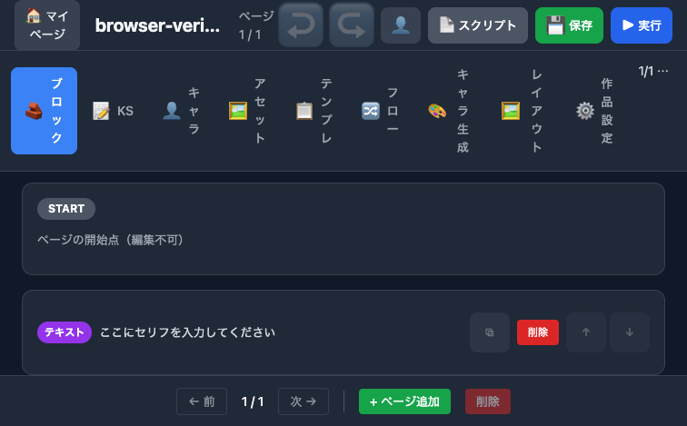
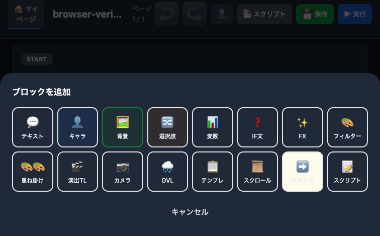
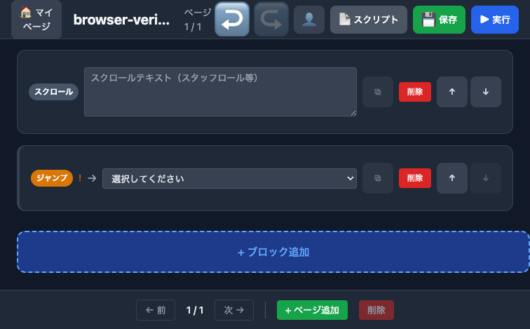
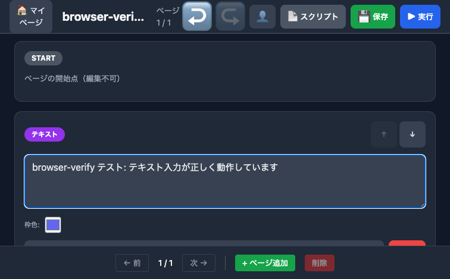
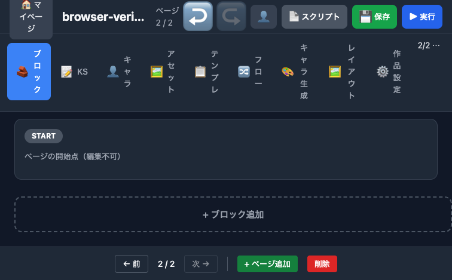
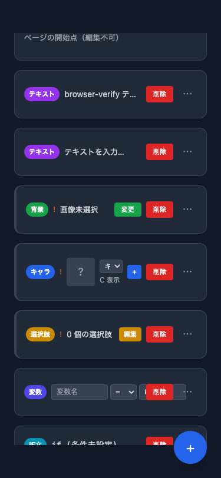

# ブロックエディタ browser-verify 検証レポート

> Generated by Claude Opus 4.6 | 2026-03-24
> 検証方式: Playwright MCP（DOM / アクセシビリティツリー）

## 検証環境

| 項目 | 値 |
|------|-----|
| 環境 | ローカル |
| URL | `http://localhost:5176/projects/editor/01KMEMAJ8T5WR2GTGVQ6X17Z7K` |
| プロジェクト | browser-verify テスト用（新規作成） |
| 認証 | `test1@example.com` / API login + localStorage 注入 |
| ビューポート | Desktop 1280x800 / Mobile 375x812 |

## Phase 1: エディタ基本構造

| # | 検証項目 | 結果 | 詳細 |
|---|---------|------|------|
| 1-1 | ページ読み込み | OK | エラーなしで表示、Loading 後に描画完了 |
| 1-2 | ヘッダー | OK | プロジェクト名「browser-verify テスト用」表示 |
| 1-3 | タブナビゲーション | OK | ブロック, KS, キャラ, アセット, テンプレ, フロー, キャラ生成, レイアウト, 作品設定（9タブ） |
| 1-4 | ブロックリスト | OK | START ブロックが先頭に存在、デフォルトテキストブロック1つ |
| 1-5 | ブロック追加ボタン | OK | 「+ ブロック追加」ボタン存在 |
| 1-6 | ページナビゲーター | OK | 「1 / 1」表示、前/次ボタン disabled |
| 1-7 | Undo/Redo | OK | 初期状態で Undo disabled、Redo disabled |

## Phase 2: ブロック追加メニュー

| # | 検証項目 | 結果 | 詳細 |
|---|---------|------|------|
| 2-1 | メニュー開閉 | OK | 「+ ブロック追加」クリックでオーバーレイ表示 |
| 2-2 | テキスト | OK | 「💬 テキスト」ボタン存在 |
| 2-3 | キャラ | OK | 「👤 キャラ」ボタン存在 |
| 2-4 | 背景 | OK | 「🖼️ 背景」ボタン存在 |
| 2-5 | 選択肢 | OK | 「🔀 選択肢」ボタン存在 |
| 2-6 | 変数 | OK | 「📊 変数」ボタン存在 |
| 2-7 | IF文 | OK | 「❓ IF文」ボタン存在 |
| 2-8 | FX | OK | 「✨ FX」ボタン存在 |
| 2-9 | フィルター | SKIP | 実装変更中のためスキップ |
| 2-10 | 重ね掛け | SKIP | 実装変更中のためスキップ |
| 2-11 | 演出TL | OK | 「🎬 演出TL」ボタン存在 |
| 2-12 | カメラ | OK | 「📷 カメラ」ボタン存在 |
| 2-13 | OVL | OK | 「🌧️ OVL」ボタン存在 |
| 2-14 | テンプレ | OK | 「📋 テンプレ」ボタン存在 |
| 2-15 | スクロール | OK | 「📜 スクロール」ボタン存在 |
| 2-16 | ジャンプ | OK | 「➡️ ジャンプ」ボタン存在 |
| 2-17 | スクリプト | OK | 「📝 スクリプト」ボタン存在 |
| 2-18 | キャンセル | OK | 「キャンセル」ボタンでメニュー閉じ |
| 2-19 | ブロック数 | OK | 16種表示（フィルター系2種含む。モバイルでは3種に制限） |

## Phase 3: ブロック追加・表示

追加した全14種（フィルター系2種除く）のカード表示を検証。

| # | ブロック | 結果 | カード内容の検証 |
|---|---------|------|----------------|
| 3-1 | text | OK | テキスト入力欄（プレースホルダー「テキストを入力…」）、複製/削除/移動ボタン |
| 3-2 | bg | OK | 「背景」バッジ、「!」警告（画像未選択）、「変更」ボタン |
| 3-3 | ch | OK | 「キャラ」バッジ、「!」警告（未選択）、キャラ選択ドロップダウン、位置「C」、「+」ボタン |
| 3-4 | choice | OK | 「選択肢」バッジ、「!」警告（選択肢なし）、「0 個の選択肢」、「編集」ボタン |
| 3-5 | set_var | OK | 「変数」バッジ、変数名テキストボックス、演算子ドロップダウン（=, +=, -=）、値「0」 |
| 3-6 | if | OK | 「IF文」バッジ、「!」警告（条件未設定）、「if (条件未設定) → T:0 / F:0」、「編集」ボタン |
| 3-7 | effect | OK | 「FX」バッジ、エフェクト選択（振動/フラッシュ等9種）、強度「3」、時間「500」ms |
| 3-8 | timeline | OK | 「演出TL」バッジ、ラベル入力、「0 tracks」、「0:05.000」 |
| 3-9 | camera | OK | 「カメラ」バッジ、「1000ms」表示 |
| 3-10 | overlay | OK | 「OVL」バッジ、「!」警告（画像未選択）、「表示」チェックボックス（checked）、「変更」ボタン |
| 3-11 | scroll_text | OK | 「スクロール」バッジ、テキストエリア（プレースホルダー「スクロールテキスト（スタッフロール等）」） |
| 3-12 | jump | OK | 「ジャンプ」バッジ、「!」警告（未選択）、ページ選択ドロップダウン（Page 1, Page 2） |
| 3-13 | ksc | OK | スクリプト追加のトースト「スクリプトブロックを追加しました」確認（※ blob タブが開いた） |
| 3-14 | START 不変 | OK | 常に先頭に固定、「ページの開始点（編集不可）」表示 |

## Phase 4: ブロック操作

| # | 検証項目 | 結果 | 詳細 |
|---|---------|------|------|
| 4-1 | 下移動 | OK | テキストブロックが2番目→3番目に移動、トースト「ブロックを下に移動しました」 |
| 4-2 | 上移動ボタン状態 | OK | 先頭ブロック（START直下）は上移動 disabled |
| 4-3 | 下移動ボタン状態 | OK | 末尾ブロックは下移動 disabled |
| 4-4 | Undo (Ctrl+Z) | OK | 移動が元に戻り、Redo ボタンが有効化 |

## Phase 5: テキストブロック編集

| # | 検証項目 | 結果 | 詳細 |
|---|---------|------|------|
| 5-1 | 展開表示 | OK | クリックで textarea + 枠色ピッカーが表示 |
| 5-2 | テキスト入力 | OK | 「browser-verify テスト: テキスト入力が正しく動作しています」を入力、DOM に正しく反映 |
| 5-3 | 枠色カラーピッカー | OK | `#6366f1`（indigo）がデフォルト、textbox で変更可能 |
| 5-4 | 折りたたみ表示 | OK | 閉じるボタンで折りたたみ、先頭テキストが省略表示 |
| 5-5 | 閉じる/削除ボタン | OK | 展開時に「閉じる」「削除」ボタン表示 |

## Phase 7: ページ操作

| # | 検証項目 | 結果 | 詳細 |
|---|---------|------|------|
| 7-1 | ページ追加 | OK | 「+ ページ追加」で2ページ目作成、ヘッダー「ページ 2 / 2」に更新 |
| 7-2 | 新ページの START | OK | Page 2 に START ブロックが自動生成 |
| 7-3 | ページ切り替え | OK | 「← 前」で Page 1 に戻り、全ブロックが維持されている |
| 7-4 | ジャンプ先更新 | OK | ジャンプブロックのドロップダウンに「Page 1」「Page 2」の2件表示 |
| 7-5 | 削除ボタン状態 | OK | 1ページのみの時は disabled、2ページ時は有効 |

## Phase 10: モバイル表示

| # | 検証項目 | 結果 | 詳細 |
|---|---------|------|------|
| 10-1 | レイアウト切り替え | OK | 375x812 で単カラムレイアウトに切り替え |
| 10-2 | FAB ボタン | OK | 右下に青い「+」フローティングボタン表示 |
| 10-3 | ブロックカード | OK | コンパクト表示（テキスト省略、3点メニュー「…」） |
| 10-4 | 各ブロック表示 | OK | text, bg, ch, 選択肢, 変数, IF文 等のバッジが正しく表示 |
| 10-5 | デスクトップ復帰 | OK | 1280x800 に戻して正常表示 |

## 総合結果

| Phase | 項目数 | OK | NG | SKIP |
|-------|--------|----|----|------|
| Phase 1: 基本構造 | 7 | 7 | 0 | 0 |
| Phase 2: 追加メニュー | 19 | 17 | 0 | 2 |
| Phase 3: ブロック追加 | 14 | 14 | 0 | 0 |
| Phase 4: ブロック操作 | 4 | 4 | 0 | 0 |
| Phase 5: テキスト編集 | 5 | 5 | 0 | 0 |
| Phase 7: ページ操作 | 5 | 5 | 0 | 0 |
| Phase 10: モバイル | 5 | 5 | 0 | 0 |
| **合計** | **59** | **57** | **0** | **2** |

## 備考

- **SKIP 2件**: フィルター（screen_filter）・重ね掛け（filter_mix）は実装変更中のためスキップ
- **ksc ブロック**: 追加時に blob URL のタブが開く挙動あり（機能上は問題なし）
- **警告表示**: bg, ch, choice, if, overlay, jump の未設定ブロックに「!」警告バッジが正しく表示
- **トースト通知**: ブロック追加・移動時に適切なフィードバックメッセージを確認
