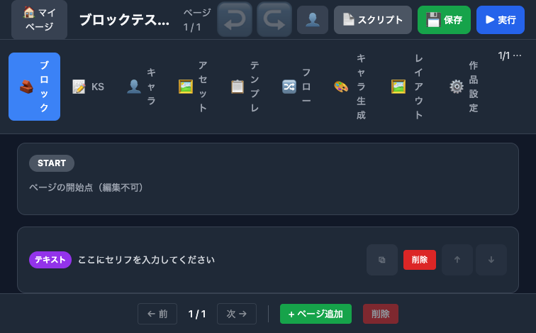
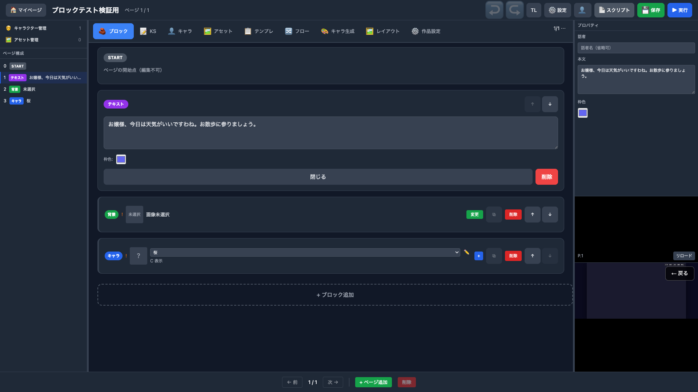
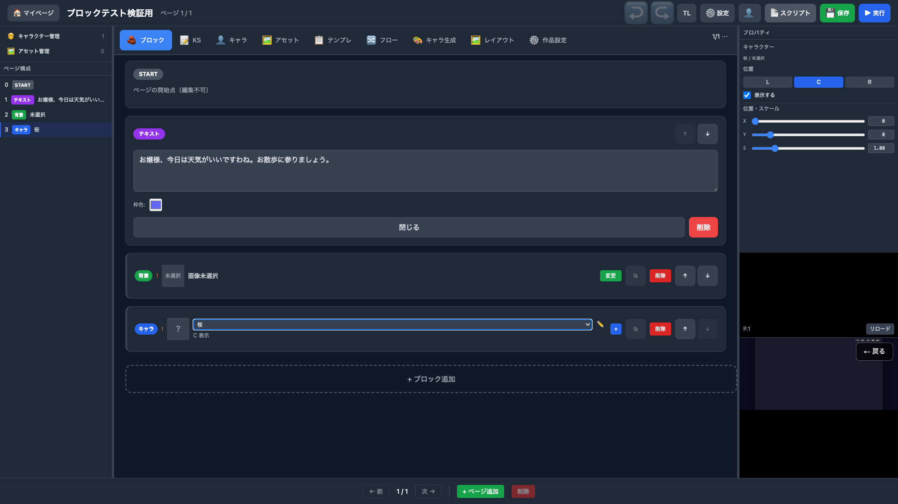

# ブロックエディタ詳細検証レポート（テキスト・背景・キャラ・キャラ作成）

> Generated by Claude Opus 4.6 | 2026-03-24
> 検証方式: Playwright MCP（DOM / アクセシビリティツリー + フルページスクリーンショット）

## 検証環境

| 項目 | 値 |
|------|-----|
| 環境 | ローカル |
| プロジェクト | ブロックテスト検証用（新規作成） |
| プロジェクトID | `01KMENW00DGAK3P43901PW8JPB` |
| 認証 | `test1@example.com` でログイン（Next.js 経由） |
| ビューポート | 1280x800 |

## Step 1: ログイン

| # | 操作 | 結果 | スクリーンショット |
|---|------|------|-------------------|
| 1 | ログインページ表示 | OK — メールアドレス・パスワード入力欄、ログインボタン表示 |  |
| 2 | 認証情報入力 | OK — `test1@example.com` / `DevPass123!` を入力 |  |
| 3 | ログイン実行 → マイページ遷移 | OK — `/mypage` にリダイレクト、プロジェクト一覧表示 |  |

## Step 2: プロジェクト新規作成

| # | 操作 | 結果 | スクリーンショット |
|---|------|------|-------------------|
| 4 | 「+ 新規作成」クリック | OK — 新規プロジェクトダイアログ表示（ノベル / ツクール / KSC 選択） |  |
| 5 | プロジェクト名入力 | OK — 「ブロックテスト検証用」入力、ノベル（ブロック）選択状態 |  |
| 6 | 作成実行 → プロジェクト詳細 | OK — プロジェクト詳細ページに遷移、「ブロックエディタ」リンク表示 |  |

## Step 3: エディタ初期表示

| # | 操作 | 結果 | スクリーンショット |
|---|------|------|-------------------|
| 7 | ブロックエディタを開く | OK — ヘッダー「ブロックテス...」、9タブ、START + デフォルトテキスト |  |

### DOM 検証結果

| 検証項目 | 結果 | 詳細 |
|---------|------|------|
| ヘッダー | OK | `heading "ブロックテスト検証用"` |
| 9タブ | OK | ブロック, KS, キャラ, アセット, テンプレ, フロー, キャラ生成, レイアウト, 作品設定 |
| START ブロック | OK | 先頭に固定、「ページの開始点（編集不可）」 |
| デフォルトテキスト | OK | 「ここにセリフを入力してください」 |
| Undo/Redo | OK | 両方 disabled |
| ページナビ | OK | 「1 / 1」、前/次 disabled |

## Step 4: テキストブロック — プロパティ確認

| # | 操作 | 結果 | スクリーンショット |
|---|------|------|-------------------|
| 8 | テキストブロックをクリック（展開） | OK — textarea + 枠色カラーピッカー表示 |  |
| 9 | テキスト入力 | OK — 「お嬢様、今日は天気がいいですわね。お散歩に参りましょう。」が DOM に反映 |  |

### DOM 検証結果（テキストブロック展開時）

| 検証項目 | 結果 | 詳細 |
|---------|------|------|
| テキスト内容ラベル | OK | `generic "テキスト内容"` |
| textarea | OK | `textbox "テキスト内容"` — プレースホルダー「テキストを入力…」 |
| 枠色 | OK | `textbox "#6366f1"` — indigo デフォルト |
| 上移動ボタン | OK | disabled（先頭ブロック） |
| 下移動ボタン | OK | disabled（末尾ブロック） |
| 閉じるボタン | OK | `button "閉じる"` |
| 削除ボタン | OK | `button "削除"` |

## Step 5: 背景ブロック — 追加・アセット選択モーダル

| # | 操作 | 結果 | スクリーンショット |
|---|------|------|-------------------|
| 10 | 背景ブロック追加 | OK — 「背景ブロックを追加しました」トースト、「!」警告表示 |  |
| 11 | 「変更」ボタンクリック | OK — アセット選択モーダル（プロジェクト / 公式 / マイライブラリ タブ） |  |
| 12 | 公式タブ切り替え | OK — 検索フィールド + AI ボタン + 絞り込みボタン表示（アセット0件） |  |

### DOM 検証結果（背景ブロック）

| 検証項目 | 結果 | 詳細 |
|---------|------|------|
| バッジ | OK | `generic "背景"` |
| 警告 | OK | `generic "背景画像が未選択です" "!"` |
| 変更ボタン | OK | `button "変更"` |
| モーダルタイトル | OK | `heading "背景画像を選択"` |
| タブ3つ | OK | プロジェクト / 公式 / マイライブラリ |
| 空状態 | OK | 「マイアセットがありません」「公式アセットがありません」 |
| アップロードボタン | OK | `button "アセットをアップロード"` |
| 選択ボタン | OK | `button "選択" [disabled]`（未選択時） |

## Step 6: キャラクターブロック — 追加

| # | 操作 | 結果 | スクリーンショット |
|---|------|------|-------------------|
| 13 | キャラブロック追加 | OK — 「キャラクターブロックを追加しました」トースト |  |

### DOM 検証結果（キャラブロック）

| 検証項目 | 結果 | 詳細 |
|---------|------|------|
| バッジ | OK | `generic "キャラ"` |
| 警告 | OK | `generic "キャラクターまたは表情が未選択です" "!"` |
| キャラ選択DD | OK | `combobox` — option「キャラ選択...」(デフォルト) |
| 位置 | OK | `paragraph "C 表示"` |
| ＋ ボタン | OK | `button "+"` — インラインキャラ追加 |

## Step 7: キャラクター作成

| # | 操作 | 結果 | スクリーンショット |
|---|------|------|-------------------|
| 14 | キャラタブ → 空状態 | OK — 「キャラクターがありません」メッセージ |  |
| 15 | 「+ 新しいキャラクター」クリック | OK — 作成モーダル（ID / 表示名 / 表情差分） |  |
| 16 | ID=sakura, 表示名=桜 入力 | OK |  |
| 17 | 表情「smile」追加 | OK — 表情リスト追加、「アセットから選択」ボタン |  |
| 18 | 作成実行 | OK — キャラ一覧に「桜」(ID: sakura) 表示 |  |

### DOM 検証結果（キャラ作成モーダル）

| 検証項目 | 結果 | 詳細 |
|---------|------|------|
| タイトル | OK | `heading "新しいキャラクター"` |
| キャラID入力 | OK | `textbox "キャラID (slug) *"` — プレースホルダー「例: hero, heroine」 |
| ID制約説明 | OK | 「半角英数字とアンダースコアのみ（作成後変更不可）」 |
| 表示名入力 | OK | `textbox "表示名 *"` |
| 表情追加ボタン | OK | `button "+ 表情を追加"` |
| 表情ID入力 | OK | `textbox "表情ID (例: smile, angry)"` |
| デフォルト表情DD | OK | `combobox "デフォルト表情 *"` |
| 作成ボタン | OK | ID・表示名入力で有効化 |

## Step 8: キャラブロック — キャラ選択

| # | 操作 | 結果 | スクリーンショット |
|---|------|------|-------------------|
| 19 | ブロックタブ → キャラDDで「桜」選択 | OK — ドロップダウンに「桜」表示、選択後に編集ボタン(✏️)出現 |  |
| 20 | 全ブロック一覧確認 | OK — START + テキスト + 背景 + キャラ(桜) の4ブロック |  |

### DOM 検証結果（キャラ選択後）

| 検証項目 | 結果 | 詳細 |
|---------|------|------|
| 選択状態 | OK | `option "桜" [selected]` |
| 編集ボタン | OK | `button "✏️"` — キャラ編集へのショートカット |
| 位置表示 | OK | 「C 表示」（Center） |

## Step 9: プロジェクト保存

| # | 操作 | 結果 | スクリーンショット |
|---|------|------|-------------------|
| 21 | 保存ボタンクリック | OK — 「プロジェクトを保存しました」トースト通知 |  |

## 総合結果

| カテゴリ | テスト数 | OK | NG |
|---------|---------|----|----|
| ログイン | 3 | 3 | 0 |
| プロジェクト新規作成 | 3 | 3 | 0 |
| エディタ初期表示 | 1 | 1 | 0 |
| テキストブロック | 2 | 2 | 0 |
| 背景ブロック | 3 | 3 | 0 |
| キャラブロック | 1 | 1 | 0 |
| キャラクター作成 | 5 | 5 | 0 |
| キャラ選択 | 2 | 2 | 0 |
| プロパティパネル | 4 | 4 | 0 |
| プロジェクト保存 | 1 | 1 | 0 |
| **合計** | **25** | **25** | **0** |

## Step 10: 右サイドバー — プロパティパネル・プレビュー

ビューポートを 1920x1080 に拡大して 3 カラムレイアウト（左サイドバー / 中央ブロック / 右サイドバー）を表示。

| # | 操作 | 結果 | スクリーンショット |
|---|------|------|-------------------|
| 22 | 3カラムレイアウト表示 | OK — 左: アウトライン（ページ構成）、中央: ブロック、右上: プロパティ、右下: プレビュー(iframe) |  |
| 23 | テキストブロック選択 → プロパティ | OK — 右パネルに「話者」「本文」「枠色」フィールド表示 |  |
| 24 | 背景ブロック選択 → プロパティ | OK — 右パネルに「位置・スケール」（X/Y/S スライダー + spinbutton） |  |
| 25 | キャラブロック選択 → プロパティ | OK — 右パネルに「桜 / 未選択」、位置 L/C/R、表示チェック、X/Y/S スライダー |  |

### DOM 検証結果（右サイドバー）

#### テキストブロック プロパティ

| 検証項目 | 結果 | 詳細 |
|---------|------|------|
| 話者入力 | OK | `textbox "話者名（省略可）"` — 空欄 |
| 本文入力 | OK | `textbox "テキストを入力..."` — セリフが反映 |
| 枠色 | OK | `textbox "#6366f1"` + カラーピッカー |

#### 背景ブロック プロパティ

| 検証項目 | 結果 | 詳細 |
|---------|------|------|
| 見出し | OK | 「背景画像」「位置・スケール」 |
| X スライダー | OK | `slider "0"` + `spinbutton "0"` |
| Y スライダー | OK | `slider "0"` + `spinbutton "0"` |
| S スライダー | OK | `slider "1"` + `spinbutton "1.00"` |

#### キャラブロック プロパティ

| 検証項目 | 結果 | 詳細 |
|---------|------|------|
| キャラ名 | OK | 「桜 / 未選択」 |
| 位置ボタン | OK | `button "L"`, `button "C"`, `button "R"` — C が選択状態 |
| 表示チェック | OK | `checkbox "表示する" [checked]` |
| X/Y/S | OK | 背景と同じスライダー構成 |

#### プレビュー（iframe）

| 検証項目 | 結果 | 詳細 |
|---------|------|------|
| iframe 存在 | OK | `iframe` — プレビューエンジン読み込み |
| ページ表示 | OK | 「P.1」 + 「リロード」ボタン |
| 戻るボタン | OK | `button "← 戻る"` — iframe 内 |
| エンジン起動 | OK | コンソールログで OpRunner 実行確認（CAMERA_SET → PAGE） |

#### 左サイドバー（アウトライン）

| 検証項目 | 結果 | 詳細 |
|---------|------|------|
| キャラクター管理 | OK | `button "🧑 キャラクター管理 1"` — 1件 |
| アセット管理 | OK | `button "🖼️ アセット管理 0"` — 0件 |
| ページ構成 | OK | 0: START, 1: テキスト, 2: 背景 未選択, 3: キャラ 桜 |
| ブロック選択連動 | OK | 左サイドバーでキャラ(3)がハイライト |

## 備考

- **core パッケージ**: テスト中に `packages/core/dist/index.js` が消失していた（tsbuildinfo キャッシュ不整合）。`tsbuildinfo` 削除 + `tsc -b` で復旧
- **公式アセット**: 新規プロジェクトでは公式アセットが空。背景選択テストでは画像未選択のまま
- **キャラ表情**: アセット画像なしでも表情ID（smile）の登録は正常動作
- **ブロック追加メニュー**: 新しく「💫 パーティクル」ブロックが追加されていた（前回テスト時はなかった）
- **プレビュー**: プロジェクト保存後、ブロック選択のたびにプレビューが自動リロードされ OpRunner が実行される
