# ブロックエディタ ビジュアル検証レポート

> Generated by Claude Opus 4.6 | 2026-03-24
> 検証方式: Playwright MCP（DOM / アクセシビリティツリー）
> ビューポート: 1920x1080（3カラム — 左サイドバー / 中央ブロック / 右プロパティ+プレビュー）

---

## 1. ログイン → プロジェクト新規作成

### 1-1. ログインページ

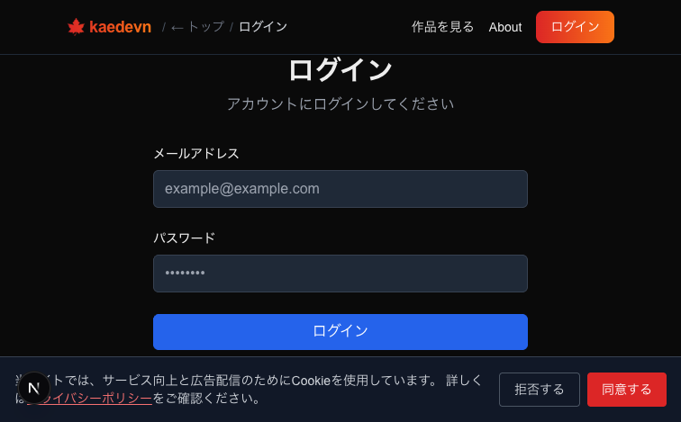

### 1-2. 認証情報入力

テストアカウント `test1@example.com` / `DevPass123!` を入力。

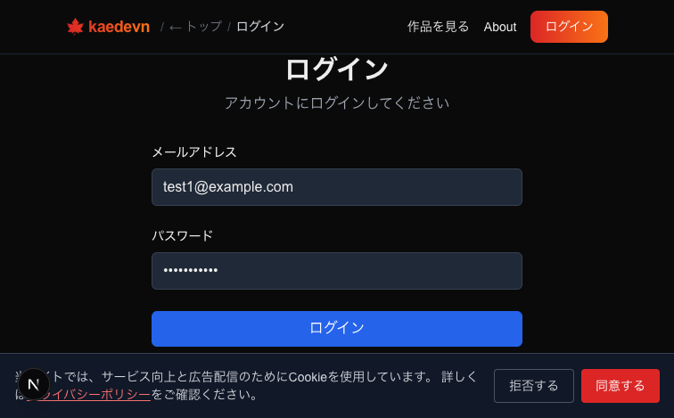

### 1-3. マイページ

ログイン成功 → マイページにリダイレクト。

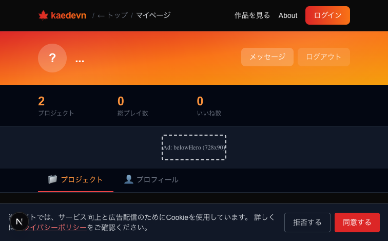

### 1-4. 新規プロジェクトダイアログ

「+ 新規作成」→ ノベル（ブロック）選択。

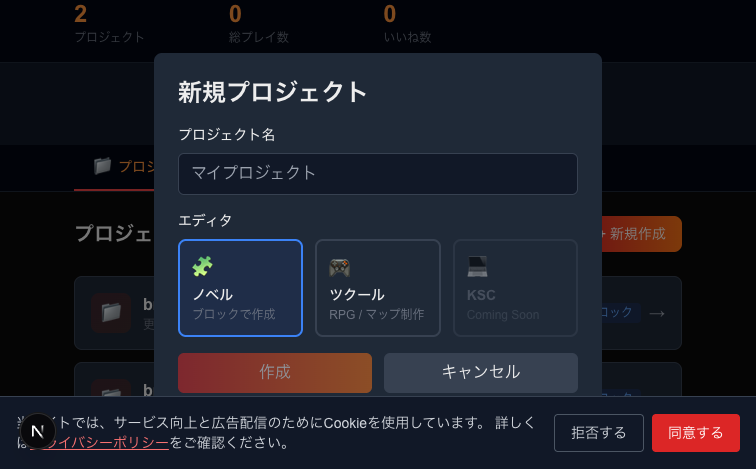

### 1-5. プロジェクト名入力

「ブロックテスト検証用」を入力。

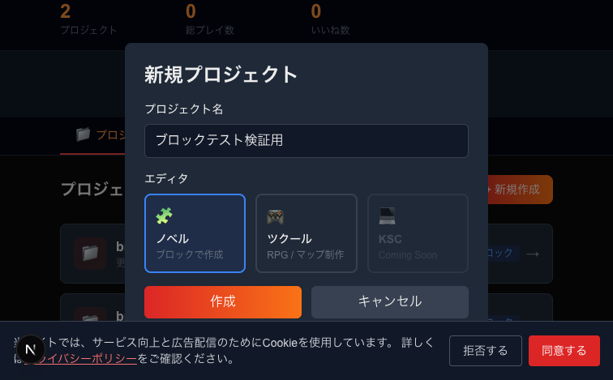

### 1-6. プロジェクト作成完了

プロジェクト詳細ページに遷移。「ブロックエディタ」リンクが表示。

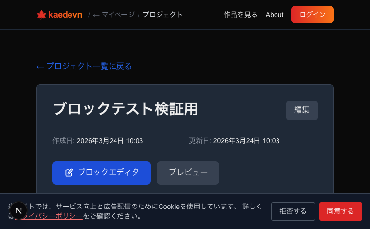

---

## 2. エディタ 3 カラムレイアウト — 初期表示

1920x1080 で開くと **左サイドバー**（ページ構成ツリー）、**中央**（ブロックリスト）、**右サイドバー**（プロパティ + プレビュー iframe）の 3 カラムが表示される。

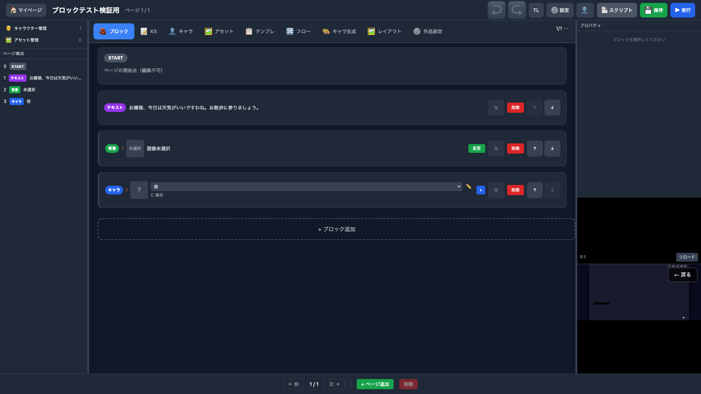

**確認項目:**
- 左: キャラクター管理(1件) / アセット管理(0件) / ページ構成（0:START, 1:テキスト, 2:背景, 3:キャラ桜）
- 中央: START + テキスト + 背景 + キャラ（桜）ブロック
- 右上: 「プロパティ — ブロックを選択してください」
- 右下: プレビュー iframe（P.1 / リロードボタン）

---

## 3. テキストブロック — プロパティ・プレビュー確認

テキストブロックをクリック。**右サイドバーにプロパティパネルが表示**され、プレビューも連動更新。

**右パネル確認項目:**

| プロパティ | 値 |
|----------|-----|
| 話者 | 空欄（省略可） |
| 本文 | 「お嬢様、今日は天気がいいですわね。お散歩に参りましょう。」 |
| 枠色 | `#6366f1`（indigo） |

**プレビュー:**
- OpRunner が CAMERA_SET → PAGE を実行（コンソールログ確認）
- iframe 内に「← 戻る」ボタン表示

---

## 4. 背景ブロック — プロパティ・プレビュー確認

背景ブロックをクリック。**右サイドバーに位置・スケールのスライダーが表示**。

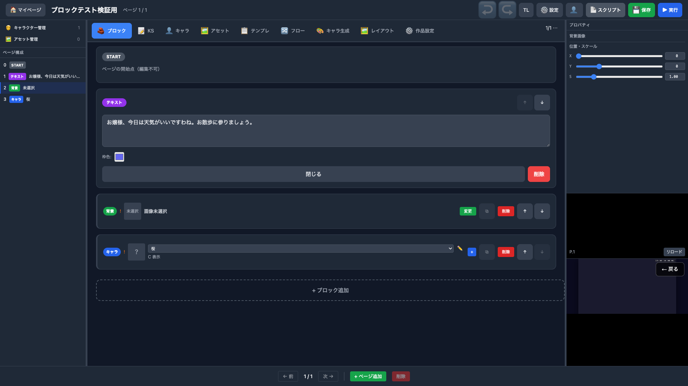

**右パネル確認項目:**

| プロパティ | コントロール | 値 |
|----------|-----------|-----|
| X | スライダー + spinbutton | 0 |
| Y | スライダー + spinbutton | 0 |
| S（スケール） | スライダー + spinbutton | 1.00 |

**左サイドバー連動:** アウトラインで「2 背景 未選択」がハイライト。

---

## 5. キャラブロック — プロパティ・プレビュー確認

キャラブロック（桜）をクリック。**右サイドバーにキャラクター設定が表示**。

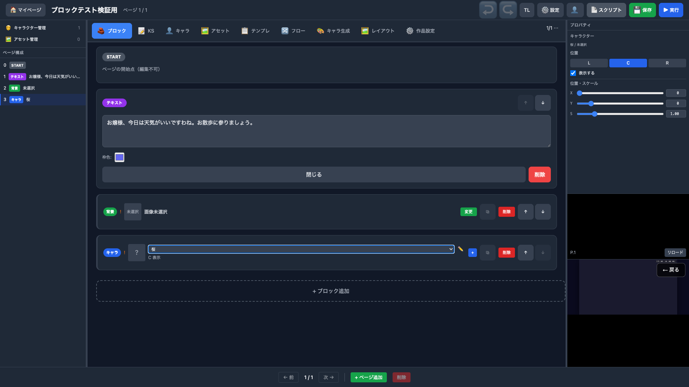

**右パネル確認項目:**

| プロパティ | コントロール | 値 |
|----------|-----------|-----|
| キャラクター | テキスト | 桜 / 未選択 |
| 位置 | L / **C** / R ボタン | C（選択状態） |
| 表示する | チェックボックス | checked |
| X | スライダー + spinbutton | 0 |
| Y | スライダー + spinbutton | 0 |
| S（スケール） | スライダー + spinbutton | 1.00 |

**左サイドバー連動:** アウトラインで「3 キャラ 桜」がハイライト。

---

## 6. ブロック操作の詳細（補足スクリーンショット）

以下は 1280x800 ビューポートで撮影した詳細操作のスクリーンショット。

### テキストブロック展開・入力

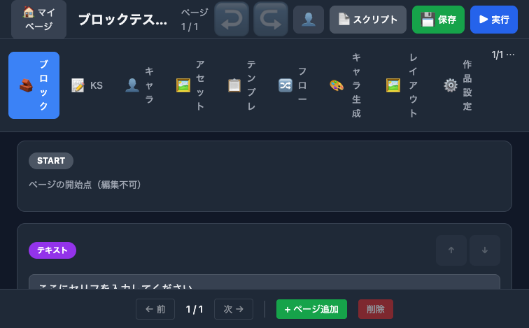
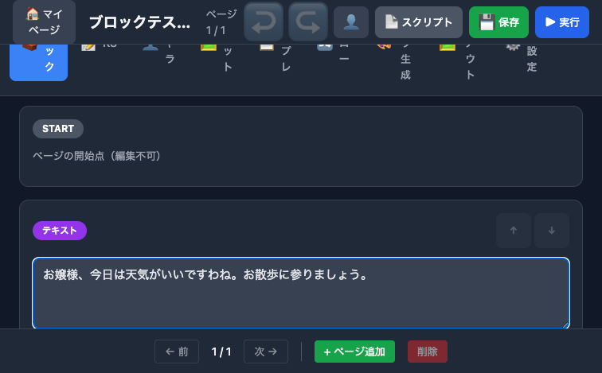

### 背景ブロック — アセット選択モーダル

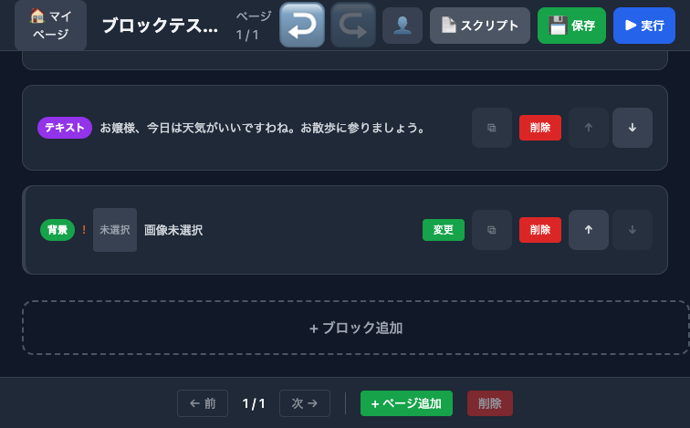
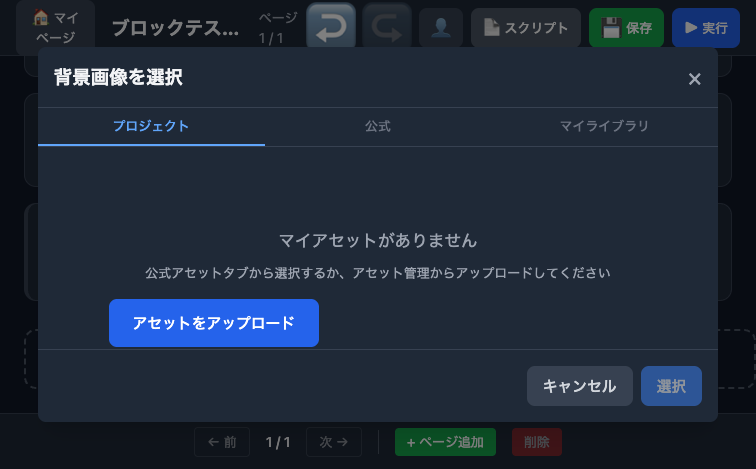
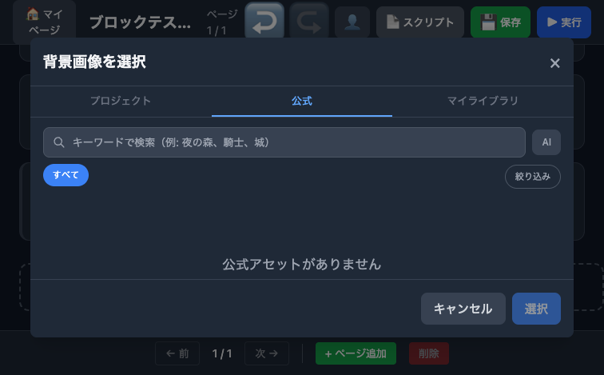

### キャラブロック追加

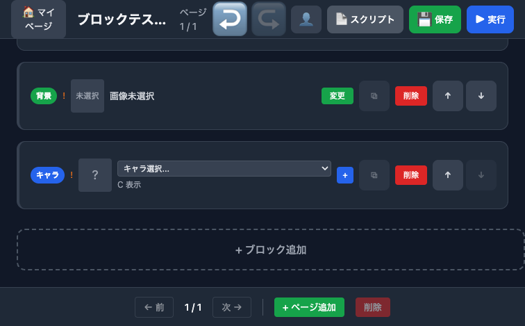

### キャラクター作成フロー

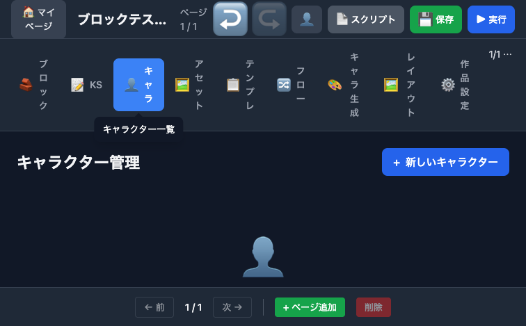
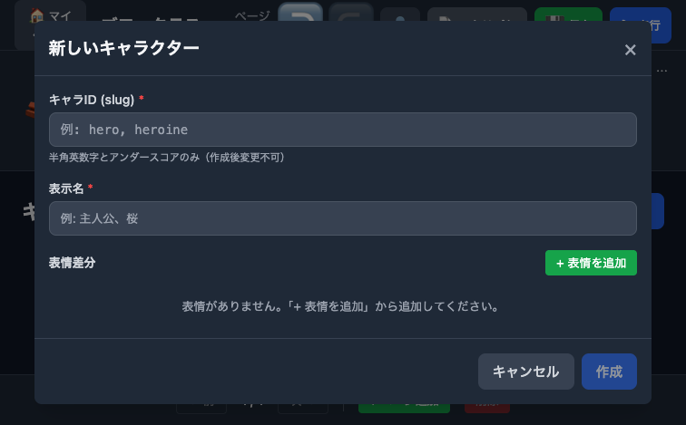
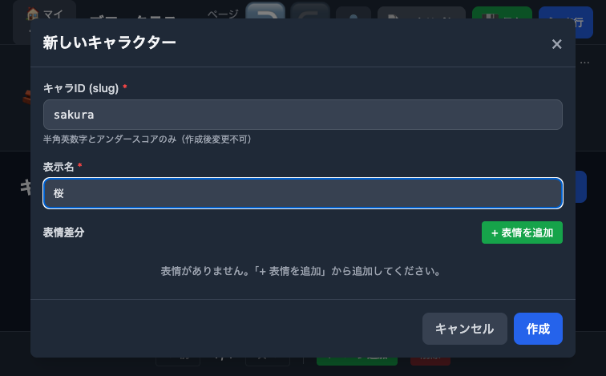
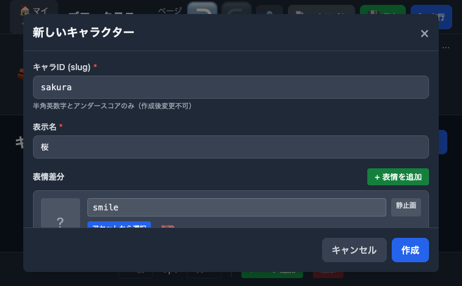
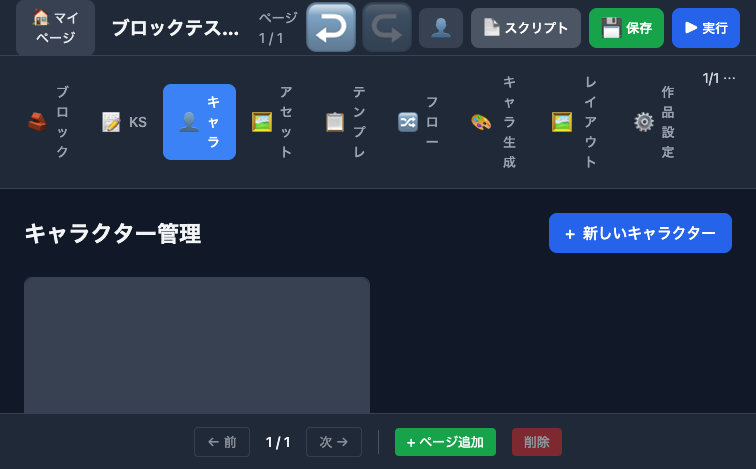

### キャラ選択 → 全ブロック確認 → 保存

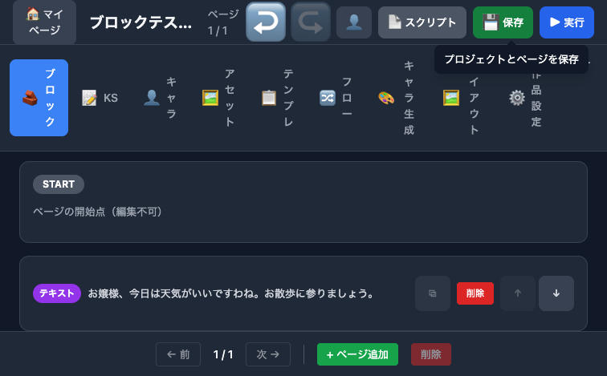

---

## 総合結果

| # | テスト項目 | プロパティ確認 | プレビュー確認 | 結果 |
|---|----------|:----------:|:----------:|:----:|
| 1 | ログイン → マイページ | — | — | OK |
| 2 | プロジェクト新規作成 | — | — | OK |
| 3 | エディタ 3 カラム初期表示 | 「ブロックを選択してください」 | iframe 読み込み | OK |
| 4 | テキストブロック選択 | 話者 / 本文 / 枠色 | OpRunner 実行 | OK |
| 5 | テキスト入力・反映 | 本文に反映 | — | OK |
| 6 | 背景ブロック選択 | X/Y/S スライダー | — | OK |
| 7 | 背景アセット選択モーダル | — | — | OK |
| 8 | キャラブロック選択 | キャラ名/位置/表示/X/Y/S | — | OK |
| 9 | キャラクター作成（ID/名前/表情） | — | — | OK |
| 10 | キャラ選択連動 | ドロップダウン反映 | — | OK |
| 11 | 左サイドバー連動 | アウトラインハイライト | — | OK |
| 12 | プロジェクト保存 | — | — | OK |

**12 / 12 OK — NG 0 件**

全スクリーンショットは 1920x1080 フルブラウザ幅で撮影し、左サイドバー（アウトライン）・中央（ブロック）・右サイドバー（プロパティ + プレビュー）の 3 カラムが確認できる。
