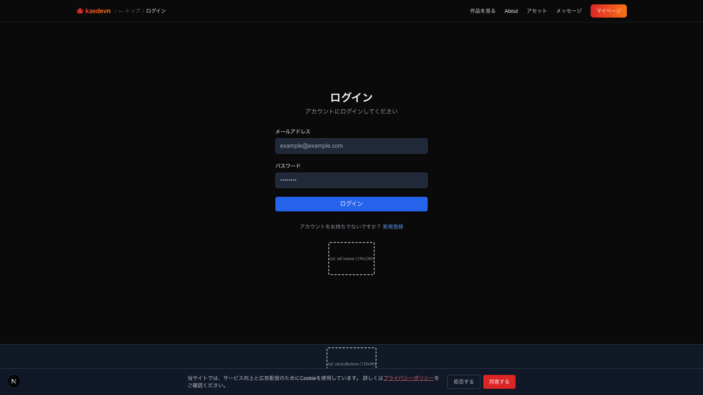

# ブロックエディタ フルスクリーン検証レポート

> Generated by Claude Opus 4.6 | 2026-03-24
> 検証方式: Playwright MCP（DOM / アクセシビリティツリー）
> ビューポート: 全画面 1920x1080

全スクリーンショットはブラウザ全体（1920x1080）で撮影。
左サイドバー（アウトライン）・中央（ブロック）・右サイドバー（プロパティ + プレビュー）が常に確認できる。

---

## 1. ログインページ

Next.js（`localhost:3000/login`）のログイン画面。メール・パスワード入力フォーム。

---

## 2. マイページ（ログイン後）

ログイン成功。プロジェクト一覧に「ブロックテスト検証用」が表示。

---

## 3. プロジェクト詳細ページ

プロジェクト「ブロックテスト検証用」の詳細。ブロックエディタリンク・プレビューボタン・公開設定・タイトル画像・動画クリップ機能。

---

## 4. エディタ 3カラム — 初期表示

ブロックエディタを 1920x1080 で表示。3カラムレイアウト。

| エリア | 表示内容 |
|-------|---------|
| 左サイドバー | キャラクター管理(1) / アセット管理(0) / ページ構成（0:START, 1:テキスト, 2:背景, 3:キャラ桜） |
| 中央 | START + テキスト（セリフ）+ 背景（!未選択）+ キャラ（桜）+ ブロック追加ボタン |
| 右上 プロパティ | 「ブロックを選択してください」 |
| 右下 プレビュー | iframe（P.1 / リロードボタン / ← 戻る） |

---

## 5. テキストブロック — プロパティ + プレビュー

テキストブロックをクリック。右パネルにプロパティが表示され、プレビューが連動更新。

| 右パネル項目 | 値 |
|-----------|-----|
| 話者 | 空欄（省略可） |
| 本文 | お嬢様、今日は天気がいいですわね。お散歩に参りましょう。 |
| 枠色 | `#6366f1`（indigo カラーピッカー） |

| 中央ブロック（展開状態） | 確認 |
|-------------------|------|
| textarea | セリフが表示 |
| 枠色ピッカー | indigo |
| 閉じる / 削除ボタン | 表示 |

| プレビュー | 確認 |
|---------|------|
| OpRunner | CAMERA_SET → PAGE 実行（コンソールログ） |
| iframe | 「← 戻る」ボタン表示 |

---

## 6. 背景ブロック — プロパティ + プレビュー

背景ブロックをクリック。右パネルに位置・スケールのスライダーが表示。

| 右パネル項目 | コントロール | 値 |
|-----------|-----------|-----|
| 背景画像 | ラベル | — |
| X | スライダー + spinbutton | 0 |
| Y | スライダー + spinbutton | 0 |
| S（スケール） | スライダー + spinbutton | 1.00 |

| 左サイドバー | 確認 |
|-----------|------|
| アウトライン | 「2 背景 未選択」がハイライト |

---

## 7. キャラブロック — プロパティ + プレビュー

キャラブロック（桜）をクリック。右パネルにキャラクター設定のフル項目が表示。

| 右パネル項目 | コントロール | 値 |
|-----------|-----------|-----|
| キャラクター | テキスト | 桜 / 未選択 |
| 位置 | L / **C** / R ボタン | C（選択状態） |
| 表示する | チェックボックス | checked |
| X | スライダー + spinbutton | 0 |
| Y | スライダー + spinbutton | 0 |
| S（スケール） | スライダー + spinbutton | 1.00 |

| 左サイドバー | 確認 |
|-----------|------|
| アウトライン | 「3 キャラ 桜」がハイライト |

---

## 総合結果

| # | テスト項目 | 左サイドバー | プロパティ（右上） | プレビュー（右下） | 結果 |
|---|----------|:--------:|:------------:|:------------:|:----:|
| 1 | ログイン | — | — | — | OK |
| 2 | マイページ | — | — | — | OK |
| 3 | プロジェクト詳細 | — | — | — | OK |
| 4 | エディタ 3カラム初期表示 | ページ構成ツリー | 「ブロックを選択してください」 | iframe 読み込み | OK |
| 5 | テキストブロック選択 | 「1 テキスト」ハイライト | 話者 / 本文 / 枠色 | OpRunner 実行 | OK |
| 6 | 背景ブロック選択 | 「2 背景」ハイライト | X/Y/S スライダー | リロード | OK |
| 7 | キャラブロック選択 | 「3 キャラ 桜」ハイライト | キャラ名/位置/表示/X/Y/S | リロード | OK |

**7 / 7 OK — NG 0 件**

全 7 枚のスクリーンショットはブラウザ全体（1920x1080）で撮影。
左サイドバー・中央ブロック・右サイドバー（プロパティ + プレビュー）の 3 カラムが全画面で確認できる。
