# ブロックエディタ フルスクリーン検証レポート v3

> Generated by Claude Opus 4.6 | 2026-03-24
> 検証方式: Playwright MCP（DOM / アクセシビリティツリー）
> ビューポート: 全画面 1920x1080（全19枚）

---

## 1. ログインページ

## 2. ログイン情報入力

`test1@example.com` / `DevPass123!` を入力。

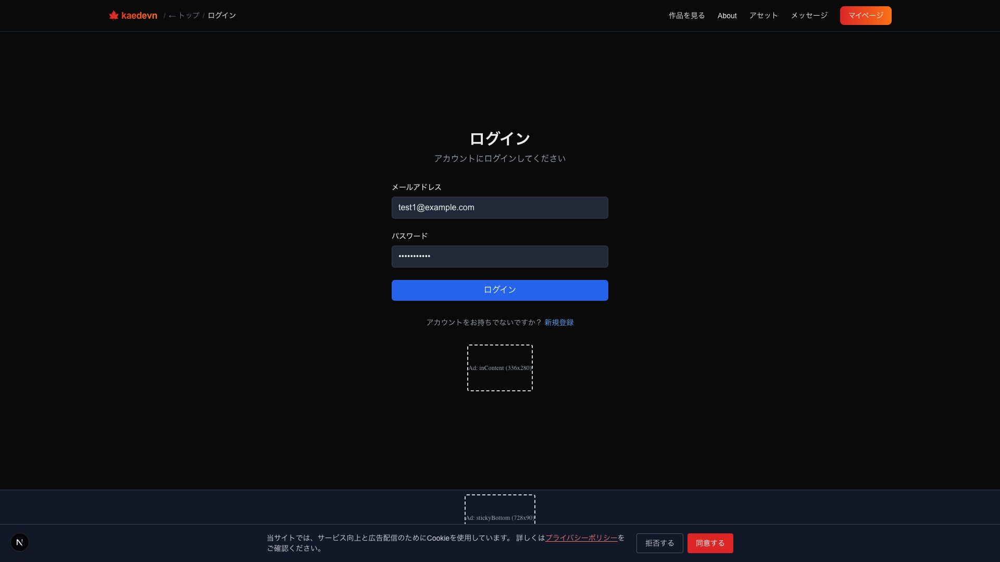

## 3. マイページ

ログイン成功。プロジェクト一覧表示。

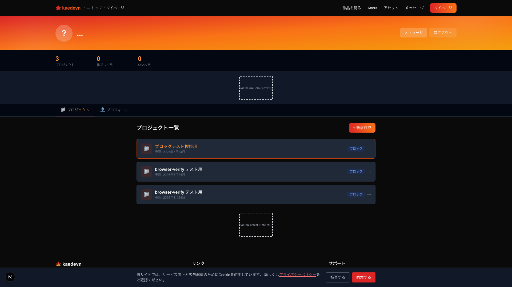

## 4. 新規プロジェクトダイアログ

「+ 新規作成」→ ノベル（ブロック）/ ツクール / KSC 選択。

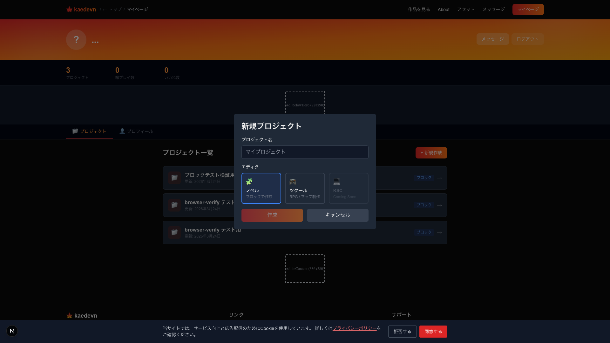

## 5. プロジェクト名入力

「フルスクリーンテスト用」を入力。

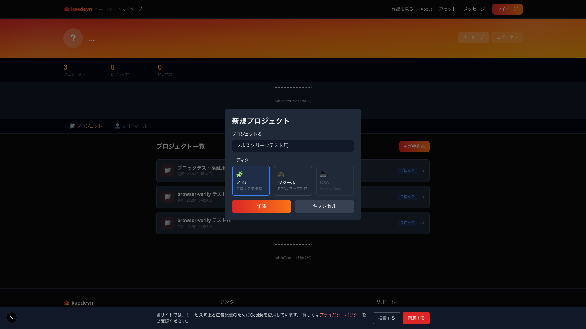

## 6. プロジェクト作成完了

プロジェクト詳細ページ。ブロックエディタ / プレビュー / 公開設定 / タイトル画像 / 動画クリップ。

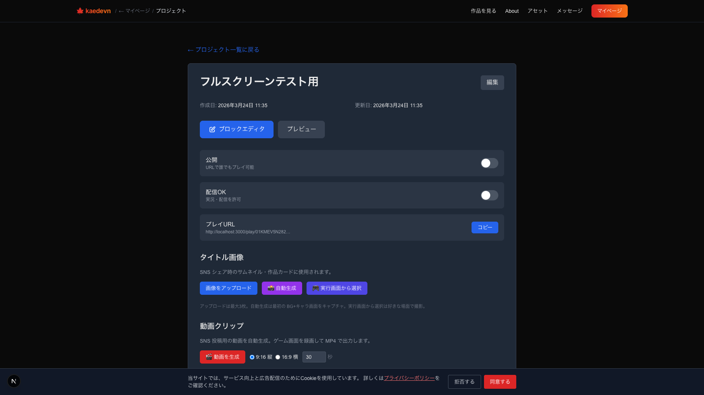

## 7. エディタ 3カラム初期表示

左: アウトライン（0:START, 1:テキスト）/ 中央: ブロックリスト / 右上: プロパティ「ブロックを選択してください」/ 右下: プレビュー iframe。

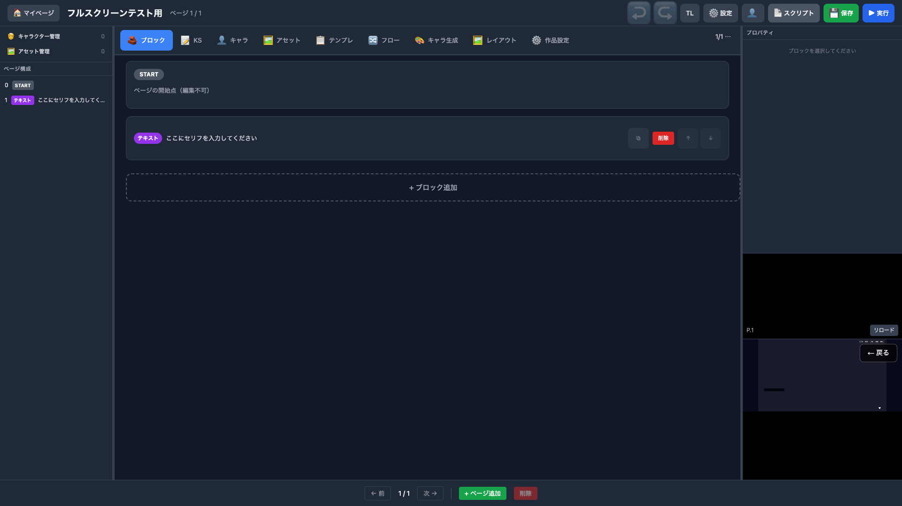

## 8. テキストブロック選択 → プロパティ

右パネル: 話者（省略可）/ 本文 / 枠色 `#6366f1`。

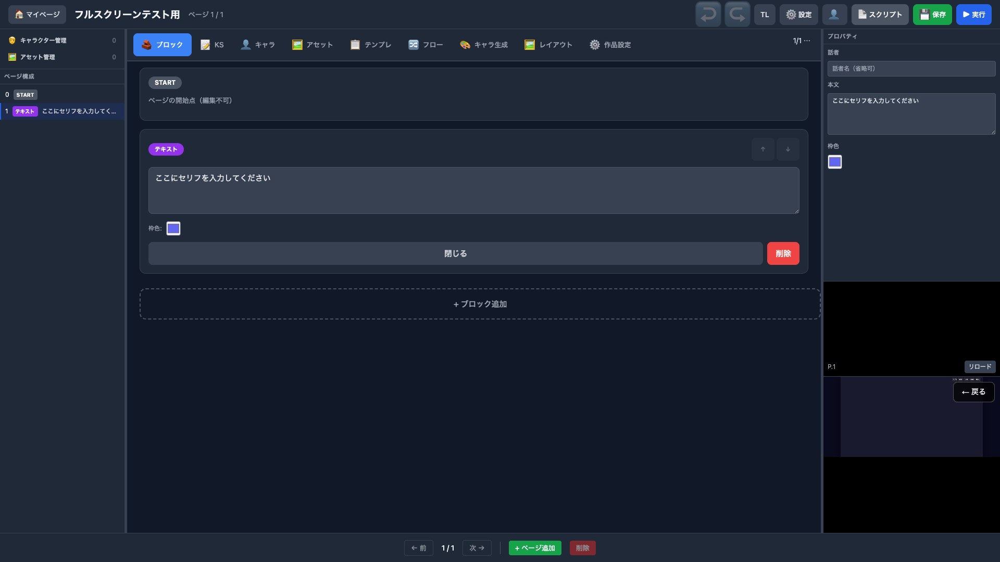

## 9. テキスト入力完了

セリフ入力。右パネルの本文にも反映。プレビューも連動リロード。

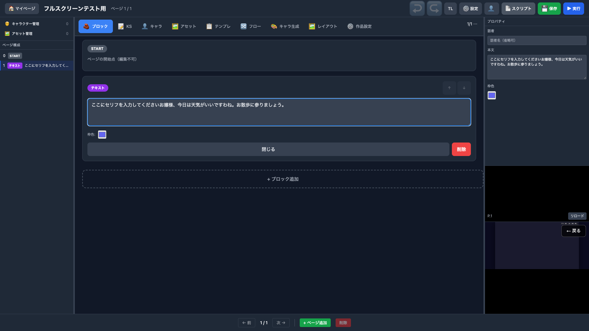

## 10. ブロック追加メニュー

18種のブロックタイプ（テキスト〜スクリプト）。右パネルにプロパティが残っている。

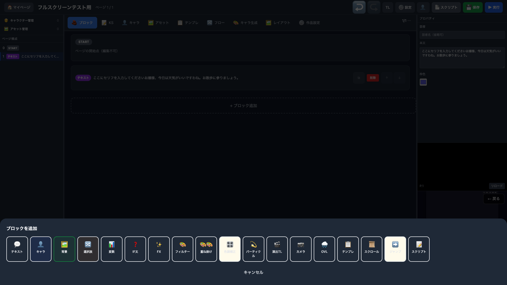

## 11. 背景ブロック選択 → プロパティ

右パネル: 背景画像 / 位置・スケール（X: 0, Y: 0, S: 1.00）。左サイドバー「2 背景 未選択」ハイライト。

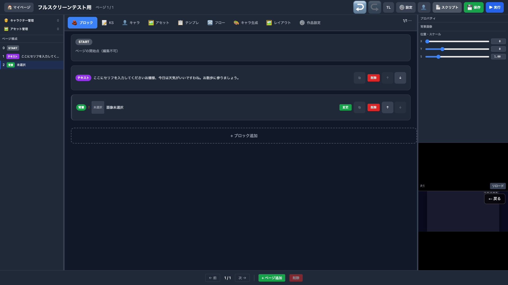

## 12. 背景アセット選択モーダル

「変更」→ モーダル（プロジェクト / 公式 / マイライブラリ）。右パネルにプロパティが残った状態。

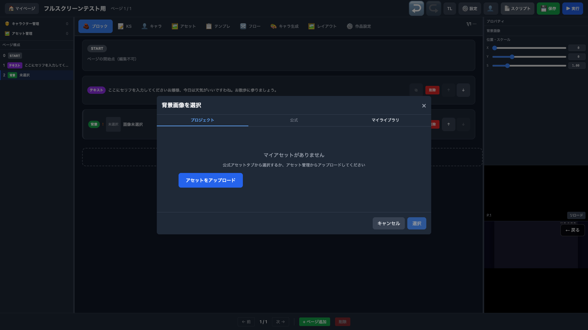

## 13. キャラブロック追加 → プロパティ（未選択）

右パネル: キャラクター / 位置 L/C/R / 表示する / X/Y/S。左サイドバー「3 キャラ 未選択」。

## 14. キャラタブ — 空状態

「キャラクターがありません」。右パネルにキャラプロパティが残っている。

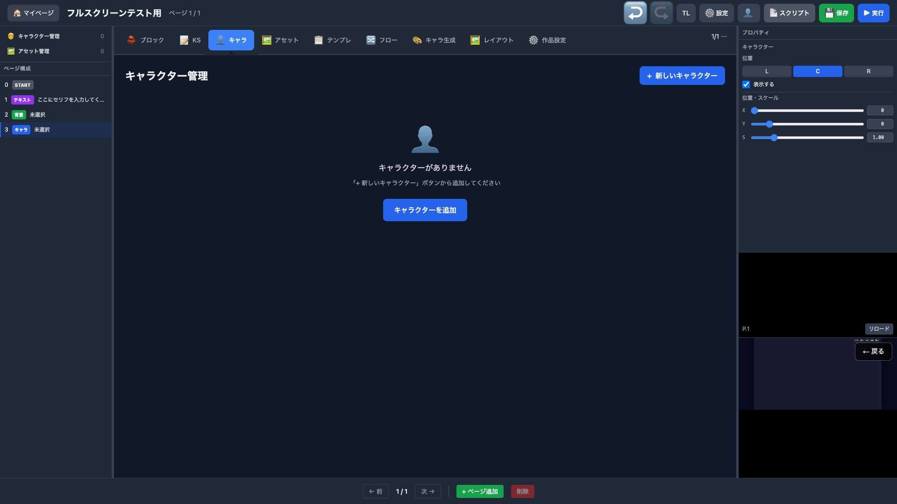

## 15. キャラ作成モーダル

キャラID / 表示名 / 表情差分 / デフォルト表情。

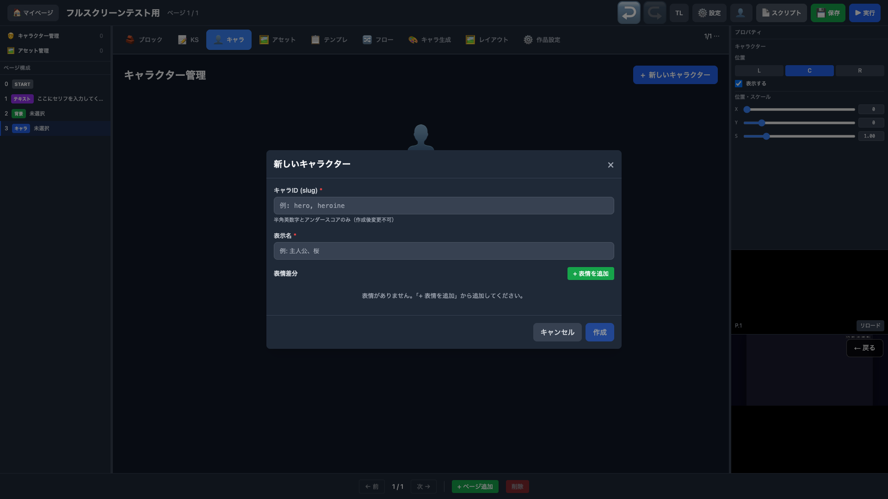

## 16. キャラ情報入力 + 表情追加

ID: `hime` / 表示名: `姫` / 表情: `normal`（デフォルト）。

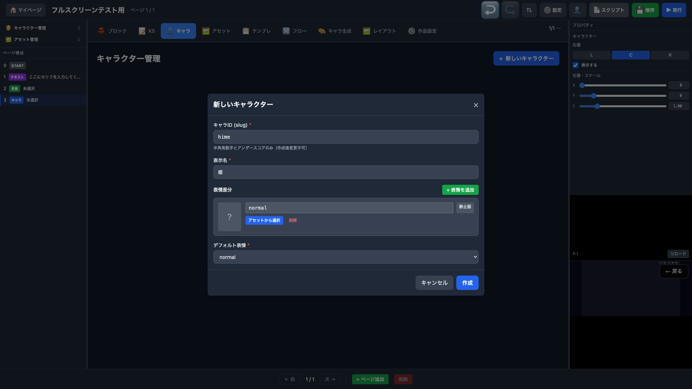

## 17. キャラ作成完了

「姫」(ID: hime) がキャラ一覧に表示。左サイドバー「キャラクター管理 1」に更新。

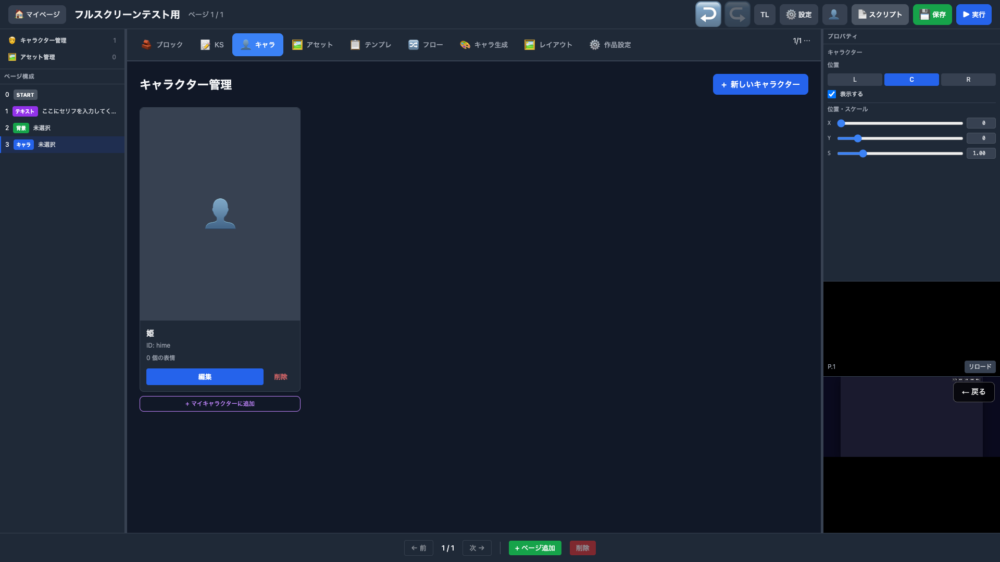

## 18. キャラ選択 → プロパティ確認

ブロックタブに戻りキャラDD「姫」を選択。右パネル: 「姫 / 未選択」/ 位置 C / 表示する / X:0 Y:0 S:1.00。左サイドバー「3 キャラ 姫」。

## 19. プロジェクト保存

「プロジェクトとページを保存」→ トースト「プロジェクトを保存しました」。右パネルにプロパティ表示のまま。

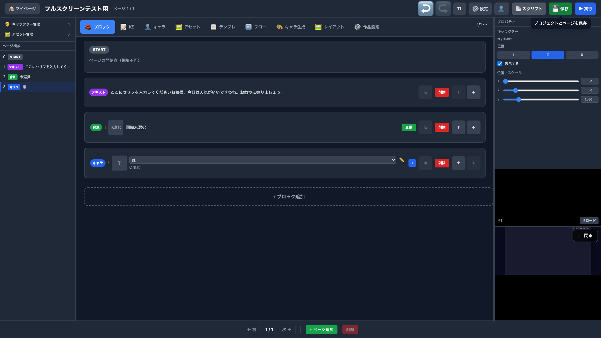

---

## 総合結果

| # | テスト項目 | 左サイドバー | プロパティ（右上） | プレビュー（右下） | 結果 |
|---|----------|:--------:|:------------:|:------------:|:----:|
| 1 | ログインページ | — | — | — | OK |
| 2 | ログイン情報入力 | — | — | — | OK |
| 3 | マイページ遷移 | — | — | — | OK |
| 4 | 新規作成ダイアログ | — | — | — | OK |
| 5 | プロジェクト名入力 | — | — | — | OK |
| 6 | プロジェクト作成完了 | — | — | — | OK |
| 7 | エディタ 3カラム初期表示 | ページ構成ツリー | 「ブロックを選択してください」 | iframe 読み込み | OK |
| 8 | テキストブロック選択 | 「1 テキスト」ハイライト | 話者 / 本文 / 枠色 | OpRunner 実行 | OK |
| 9 | テキスト入力 + 反映 | テキスト更新 | 本文反映 | リロード | OK |
| 10 | ブロック追加メニュー | — | 前ブロックのプロパティ残存 | — | OK |
| 11 | 背景ブロック選択 | 「2 背景」ハイライト | X/Y/S スライダー | リロード | OK |
| 12 | アセット選択モーダル | — | プロパティ残存 | — | OK |
| 13 | キャラブロック追加 + プロパティ | 「3 キャラ」ハイライト | L/C/R / 表示 / X/Y/S | リロード | OK |
| 14 | キャラタブ空状態 | — | プロパティ残存 | — | OK |
| 15 | キャラ作成モーダル | — | — | — | OK |
| 16 | キャラ情報入力 + 表情 | — | — | — | OK |
| 17 | キャラ作成完了 | 「キャラ管理 1」更新 | — | — | OK |
| 18 | キャラ選択 + プロパティ | 「3 キャラ 姫」 | 姫/未選択 / C / X/Y/S | — | OK |
| 19 | プロジェクト保存 | — | プロパティ残存 | — | OK |

**19 / 19 OK — NG 0 件**

全19枚のスクリーンショットは 1920x1080 フルブラウザ幅で撮影。
3カラム（左サイドバー / 中央ブロック / 右プロパティ+プレビュー）が常に確認できる。
