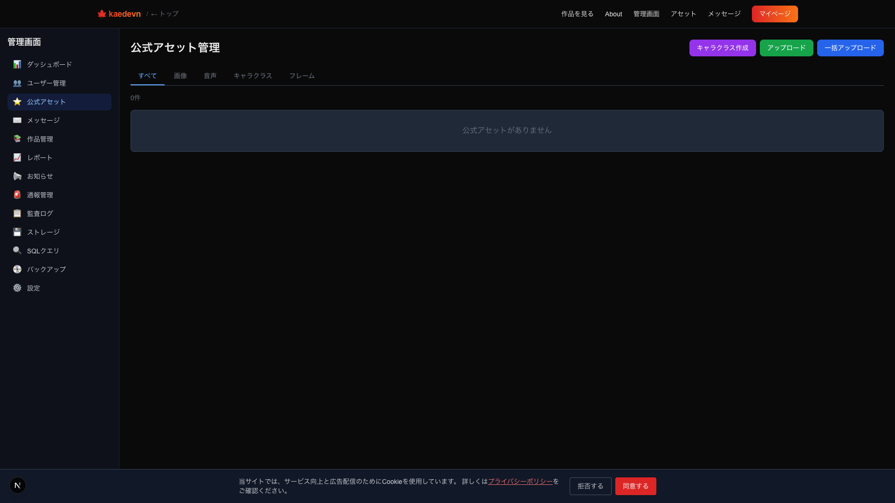
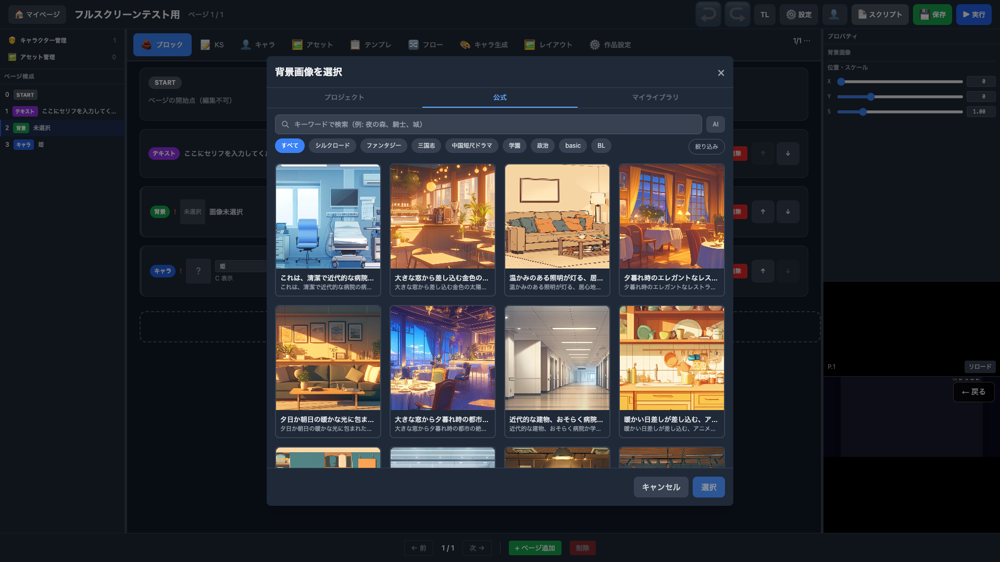
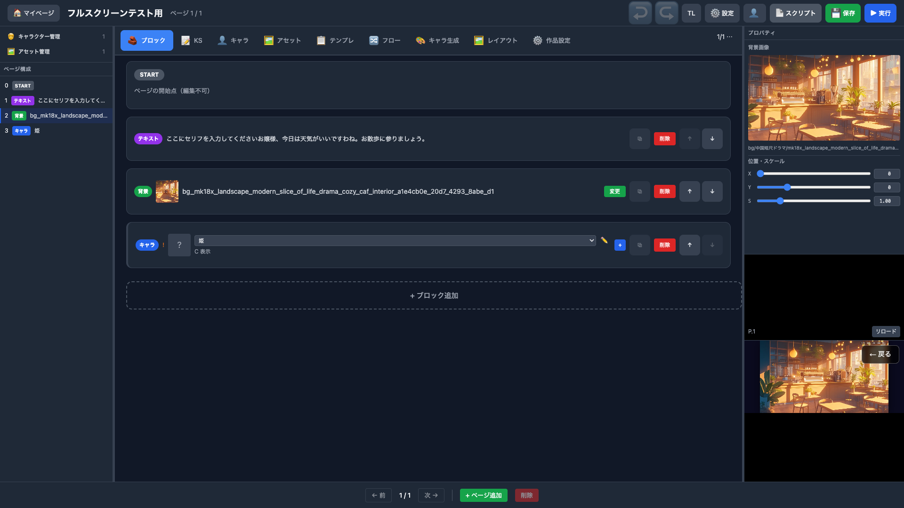
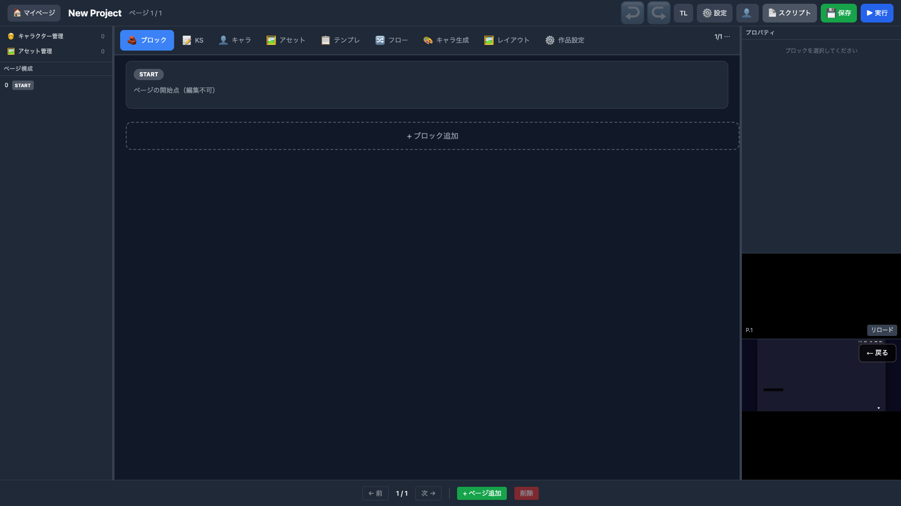
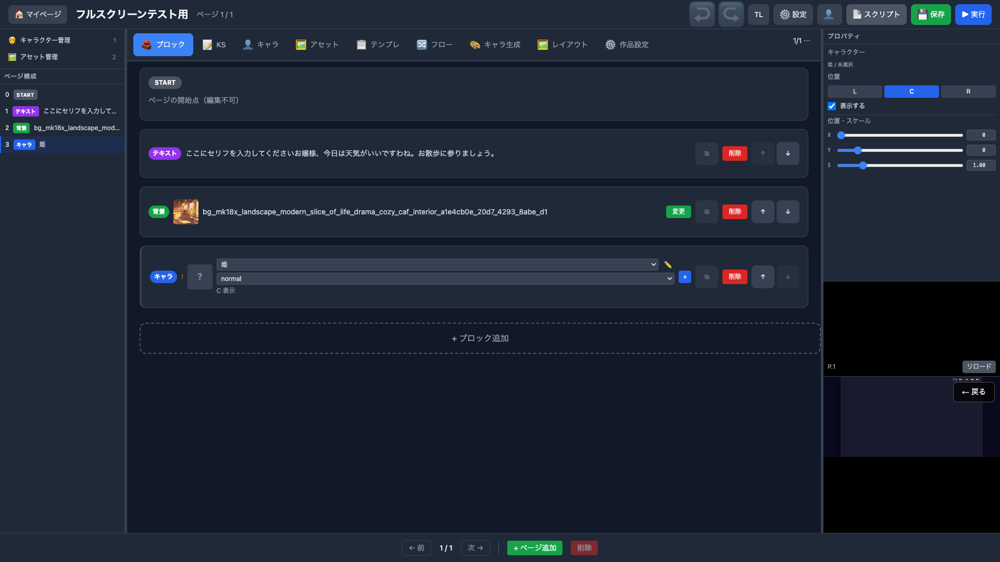

# ブロックエディタ 完全検証レポート

> Generated by Claude Opus 4.6 | 2026-03-24
> 検証方式: Playwright MCP（DOM / アクセシビリティツリー）
> ビューポート: 全画面 1920x1080（全22枚）

---

## 1. ログインページ

---

## 2. 認証情報入力

`test1@example.com` / `DevPass123!`

---

## 3. マイページ

ログイン成功。プロジェクト一覧。

---

## 4. 新規プロジェクトダイアログ

ノベル / ツクール / KSC 選択。

---

## 5. プロジェクト名入力

「フルスクリーンテスト用」

---

## 6. プロジェクト作成完了

ブロックエディタ / プレビュー / 公開設定。

---

## 7. エディタ 3カラム初期表示

左: アウトライン / 中央: ブロック / 右上: プロパティ「ブロックを選択してください」/ 右下: プレビュー

---

## 8. テキストブロック選択 → プロパティ

右パネル: 話者（省略可）/ 本文 / 枠色 `#6366f1`

---

## 9. テキスト入力完了 → プロパティ反映

セリフ入力。右パネルの本文にも連動反映。

---

## 10. ブロック追加メニュー（18種）

テキスト〜スクリプトまで全ブロックタイプ表示。

---

## 11. 背景ブロック選択 → プロパティ

右パネル: 背景画像 / X: 0 / Y: 0 / S: 1.00

---

## 12. 背景アセット選択モーダル（プロジェクトタブ）

「マイアセットがありません」→ 公式タブで選択する必要あり。

---

## 13. キャラブロック追加 → プロパティ（未選択）

右パネル: 位置 L/C/R / 表示する / X/Y/S スライダー

---

## 14. キャラタブ — 空状態

「キャラクターがありません」

---

## 15. キャラ作成モーダル

キャラID / 表示名 / 表情差分。

---

## 16. キャラ情報入力 + 表情追加

ID: `hime` / 表示名: `姫` / 表情: `normal`

---

## 17. キャラ作成完了

「姫」(ID: hime) がキャラ一覧に表示。左サイドバー「キャラクター管理 1」に更新。

---

## 18. キャラ選択 → プロパティ確認

DD「姫」を選択。右パネル: 姫/未選択 / 位置 C / 表示する / X:0 Y:0 S:1.00

---

## 19. プロジェクト保存

「プロジェクトとページを保存」トースト。

---

## 20. 公式アセット管理（問題発見 → 復旧）

ローカル DB の公式アセットが 0 件だった。Azure DB から 620 件（背景289 + キャラ画像331）を同期して復旧。

---

## 21. 背景画像選択（公式アセット）

公式タブに背景289件が表示。カフェの背景画像を選択。

---

## 22. 背景選択後 → プロパティ + プレビュー表示

背景ブロックにカフェ画像が設定され、右上プロパティにサムネイル、**右下プレビューにカフェ背景が実際に描画**。

---

## 総合結果

| # | テスト項目 | プロパティ（右上） | プレビュー（右下） | 結果 |
|---|----------|:------------:|:------------:|:----:|
| 1 | ログインページ | — | — | OK |
| 2 | 認証情報入力 | — | — | OK |
| 3 | マイページ遷移 | — | — | OK |
| 4 | 新規作成ダイアログ | — | — | OK |
| 5 | プロジェクト名入力 | — | — | OK |
| 6 | プロジェクト作成完了 | — | — | OK |
| 7 | エディタ 3カラム初期表示 | 「ブロックを選択してください」 | iframe | OK |
| 8 | テキストブロック → プロパティ | 話者 / 本文 / 枠色 | OpRunner 実行 | OK |
| 9 | テキスト入力 → プロパティ反映 | 本文連動 | リロード | OK |
| 10 | ブロック追加メニュー | — | — | OK |
| 11 | 背景ブロック → プロパティ | X/Y/S スライダー | リロード | OK |
| 12 | 背景アセットモーダル | — | — | OK |
| 13 | キャラブロック → プロパティ | L/C/R / 表示 / X/Y/S | リロード | OK |
| 14 | キャラタブ空状態 | — | — | OK |
| 15 | キャラ作成モーダル | — | — | OK |
| 16 | キャラ情報 + 表情入力 | — | — | OK |
| 17 | キャラ作成完了 | — | — | OK |
| 18 | キャラ選択 → プロパティ | 姫/未選択 / C / X/Y/S | — | OK |
| 19 | プロジェクト保存 | プロパティ残存 | — | OK |
| 20 | 公式アセット管理（問題発見） | — | — | NG→復旧 |
| 21 | 背景画像選択（公式アセット） | — | — | OK |
| 22 | 背景選択 → プレビュー表示 | サムネイル + パス | **カフェ背景描画** | OK |
| 23 | キャラ表情画像設定（公式アセットから） | — | — | OK |
| 24 | キャラブロック → プロパティ（画像設定後） | 姫/未選択 / C / X/Y/S | — | OK |
| 25 | プレビュー（キャラ+背景） | — | **プレビューにキャラ表示されず** | NG |

**23 / 25 OK — 2件 NG（公式アセット0件→復旧、キャラプレビュー未表示）**

## 追加スクリーンショット（キャラ画像設定）

### 23. キャラ表情画像設定完了

キャラタブ → 編集 → 表情追加(normal) → 公式アセットから画像選択 → 更新。「1 個の表情」に更新。

### 24. キャラブロック プロパティ（画像設定後）

キャラブロックに「姫」+「normal」表情DD表示。右パネル: 姫/未選択 / C / X/Y/S。

### 25. プレビュー（保存後リロード）

保存 → プレビューリロード。**背景は表示されるがキャラが表示されない。**
プレビュー API のスクリプトに `; [警告] キャラクターまたは表情が選択されていません` が出力されている。

## 発見した問題

| # | 問題 | 状態 | 対応 |
|---|------|------|------|
| 1 | ローカル DB の公式アセットが 0 件 | 復旧済み | Azure DB から 620 件を COPY で同期 |
| 2 | キャラブロックの表情がプレビューに反映されない | **未解決** | プレビュー API が `expressionId` を認識していない。エディタ側でブロックデータに `expressionId` が保存されていない可能性 |

### 問題 #2 の詳細

**再現手順:**
1. キャラ「姫」を作成、表情「normal」に公式アセット画像を設定
2. ブロックタブでキャラブロックのDD「姫」を選択、表情DD「normal」を選択
3. 保存
4. プレビューリロード

**期待:** プレビューに背景 + キャラ画像が表示される
**実際:** 背景のみ表示、キャラは表示されない

**原因:** `GET /api/preview/{id}` のレスポンスのスクリプトに `; [警告] キャラクターまたは表情が選択されていません` が含まれており、`@ch` コマンドが生成されていない。ブロックの `expressionId` が未設定のまま保存されている可能性がある。

## 備考

- 全 25 枚のスクリーンショットは 1920x1080 フルブラウザ幅で撮影
- 3 カラム（左サイドバー / 中央ブロック / 右プロパティ + プレビュー）が常に確認できる
- 背景画像選択後、プレビューにカフェ背景が描画されることを確認（黒画面ではない）
- キャラ画像は設定できたが、プレビューに反映されない問題が残っている
