# kaedevn RPG Studio — プロトタイプ ショーケース

> Generated by Claude Opus 4.6

1セッションで仕様策定 → 実装 → 遊べる RPG まで到達したプロトタイプの全貌。

---

## 1. エディタ機能（7タブ）

### Database — Schema 駆動のデータ編集

Entity Graph のデータを Schema から自動生成された UI で編集する。左にリスト、右にプロパティ + Relation 表示。

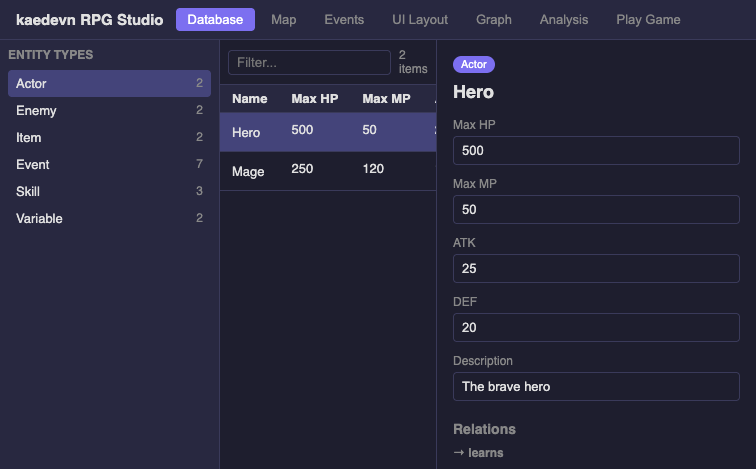

- Entity Type をサイドバーで切替（Actor / Enemy / Skill / Item / Variable / Event）
- テーブルのカラムは Schema の PropertyDef から動的生成
- 行クリックで DetailView — プロパティ編集 + 「→ learns: Slash」のような Relation 表示

---

### Graph — Entity 間の関係を力学シミュレーションで可視化

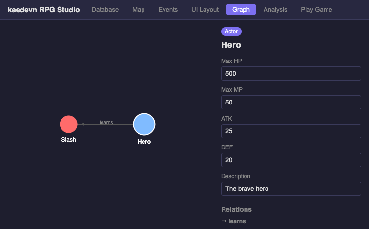

- Hero → learns → Slash の関係がグラフで見える
- ノードをドラッグで移動、クリックで DetailView と連動
- 設計原理 R1（データをグラフとして双方向に辿れる）の実現

---

### Analysis — 静的解析 + バランスシミュレーター

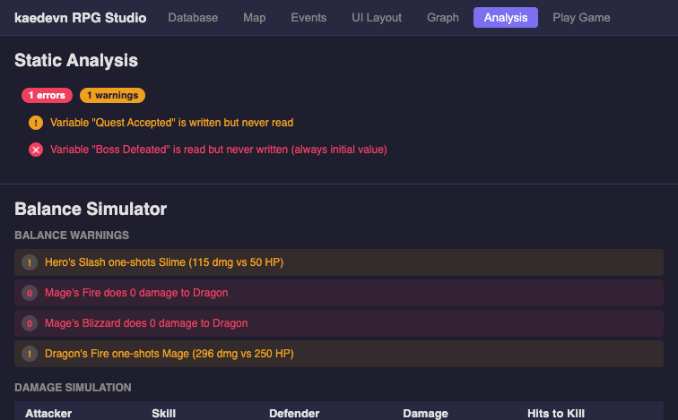

**静的解析**:
- 「Quest Accepted は書かれるが読まれない」（未使用の可能性）
- 「Boss Defeated は読まれるが書かれない」（常に初期値 = バグ）

**バランスシミュレーター**:
- 全 Attacker × Skill × Defender の組み合わせでダメージ自動計算
- ワンショット警告: Hero の Slash が Slime を一撃（115 dmg vs 50 HP）
- ゼロダメージ警告: Mage の Fire が Dragon に 0 ダメージ

---

### Map — PixiJS タイルマップエディタ

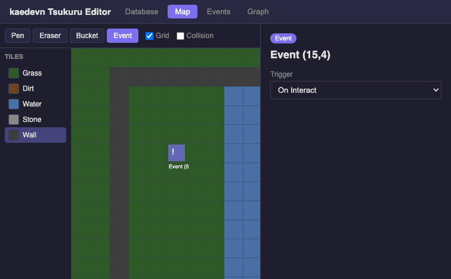

- ツール: Pen / Eraser / Bucket / Event
- タイルパレット: Grass / Dirt / Water / Stone / Wall
- イベント配置: クリックで Entity 自動生成、! / T アイコンでトリガー種別表示
- Grid / Collision 表示切替

---

### Events — コマンドエディタ + フロービュー

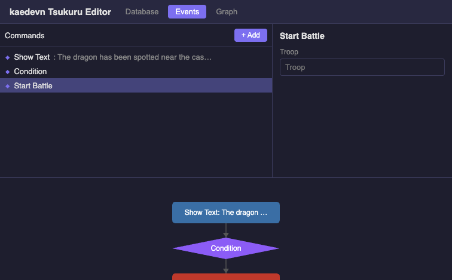

- 上: ◆ 表記のコマンドリスト + プロパティパネル（Schema 駆動）
- 下: コマンドツリーをフローチャートで自動可視化
- カテゴリ別コマンドパレット: Expression / State / Flow / Scene / Call

---

### UI Layout — WYSIWYG レイアウトエディタ

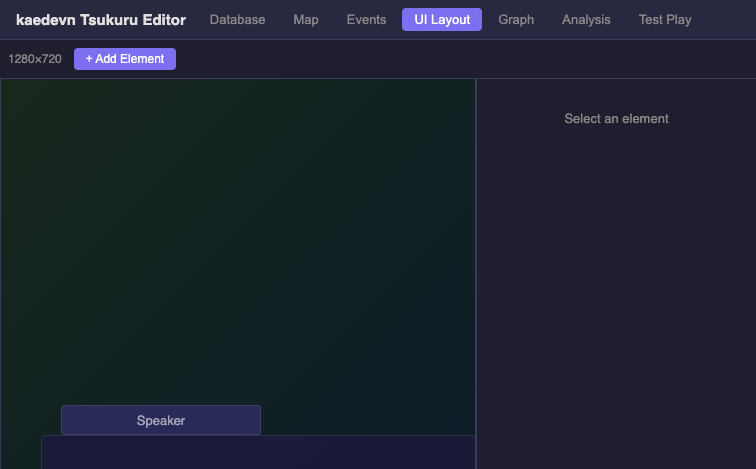

- 1280×720 キャンバス上で UI 要素をドラッグ＆ドロップ配置
- メッセージウィンドウ、名前ボックス、Auto/Skip/Log ボタン
- プロパティパネルで位置・サイズ・色・透明度を調整

---

### Test Play — コンパイラ + ランタイム + デバッガ

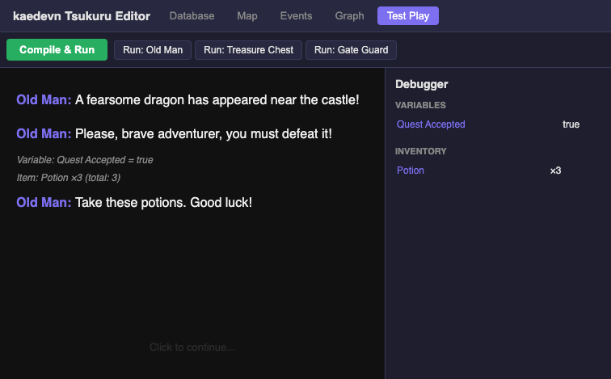

- Compile & Run: Entity Graph → Instruction Stream → Runtime 実行
- テキスト表示、変数セット、アイテム取得がリアルタイムで動作
- デバッガ: Variables / Inventory をリアルタイム監視

---

## 2. ゲームプレイ

### 町マップ — ゲーム開始

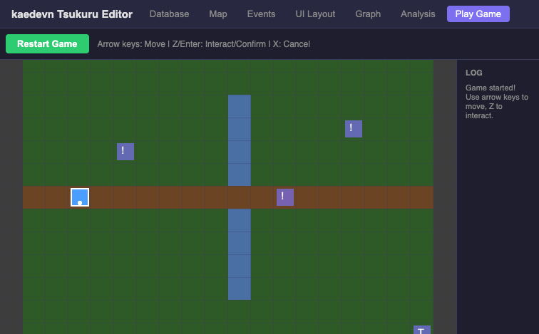

- プレイヤー（青い四角）を矢印キーで操作
- ! マーカー: interact イベント（NPC、宝箱、門番）
- T マーカー: player_touch イベント（階段）

---

### NPC会話 — Old Man

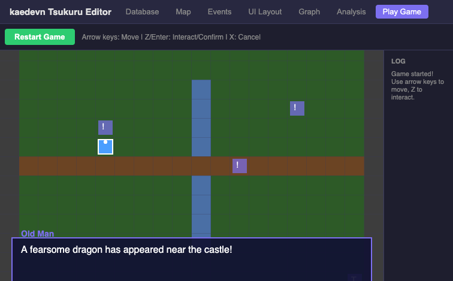

- Old Man の前で Z キー → メッセージウィンドウ表示
- 「A fearsome dragon has appeared near the castle!」

---

### クエスト受諾 + アイテム取得

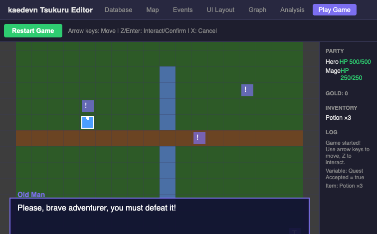

- 会話を進めると変数セット + アイテム取得が自動実行
- サイドバー: **Potion ×3** 取得、**Quest Accepted = true**
- デバッガがリアルタイムで状態変化を追跡

---

### ダンジョン — スライム出現

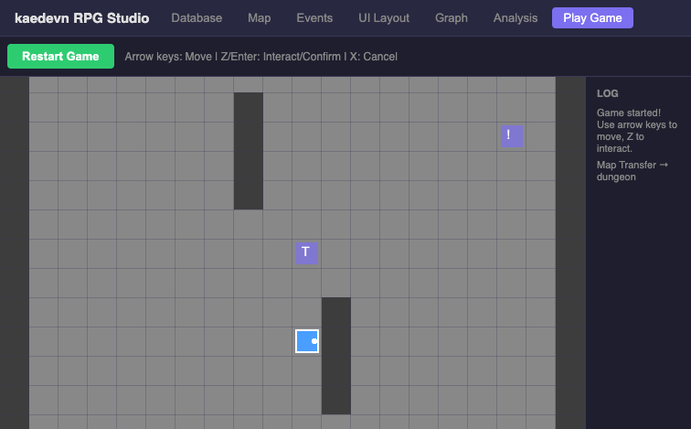

- 階段（T マーカー）を踏むと MAP_TRANSFER でダンジョンに遷移
- スライムの player_touch イベントに接触 → 「A slime appeared!」

---

### バトル — ターン制コマンド戦闘

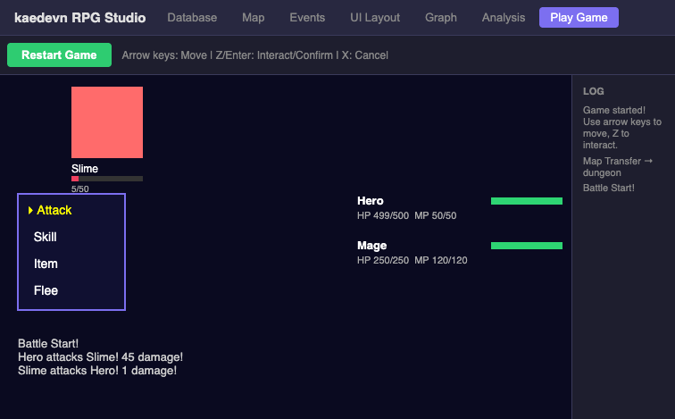

- コマンド: **▸ Attack** / Skill / Item / Flee
- ダメージ計算: Entity の formula プロパティ（`a.atk * 4 - b.def * 2`）を評価
- 「Hero attacks Slime! 45 damage!」→ Slime HP 5/50
- 「Slime attacks Hero! 1 damage!」→ Hero HP 499/500
- HP バーがリアルタイムで減少

---

### 勝利 — マップ復帰

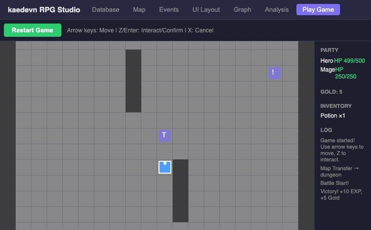

- スライム撃破 → EXP + Gold + ドロップアイテム獲得
- バトル画面からマップに自動復帰
- サイドバー: **Gold: 5**, **Potion ×1**（ドロップ）, **Victory! +10 EXP, +5 Gold**

---

## 3. 技術スタック

| レイヤー | 技術 |
|---------|------|
| データモデル | Entity Graph（Entity + Relation + Schema） |
| 状態管理 | Zustand（vanilla store） |
| エディタ UI | React + CSS |
| マップ/ゲーム描画 | PixiJS 8 |
| コンパイラ | Entity Graph → Instruction Stream |
| ランタイム | Promise ベース命令実行エンジン |
| 永続化 | LocalStorage |
| テスト | Vitest（49テスト全通過） |

## 4. ファイル構成

```
packages/entity-graph/          ← コアライブラリ（49テスト）
├── types/                      Entity, Relation, Schema, CommandNode
├── store/                      EntityStore
├── schema/                     バリデーション + ファクトリ
├── storage/                    Memory + LocalStorage
├── analysis/                   RelationExtractor + StaticAnalyzer + BalanceAnalyzer
├── compiler/                   Entity Graph → Instruction Stream
└── runtime/                    命令実行エンジン

apps/rpg-studio/                ← エディタ + ゲーム（7タブ）
├── components/
│   ├── TableView.tsx           Schema 駆動テーブル
│   ├── DetailView.tsx          プロパティ + Relation 編集
│   ├── CommandEditor.tsx       ◆コマンドリスト
│   ├── FlowView.tsx            フローチャート可視化
│   ├── SpatialView.tsx         PixiJS マップエディタ
│   ├── GraphView.tsx           力学シミュレーション関係グラフ
│   ├── CanvasView.tsx          WYSIWYG UIレイアウト
│   ├── AnalysisPanel.tsx       静的解析 UI
│   ├── BalancePanel.tsx        バランスシミュレーター
│   ├── TestPlayView.tsx        テキストベーステストプレイ
│   └── PlayableGameView.tsx    PixiJS ゲームプレイ
└── game/
    ├── GameScene.ts            マップ描画 + プレイヤー移動
    ├── BattleScene.ts          ターン制バトル
    └── GameController.ts       全体統合（マップ↔バトル↔ランタイム）
```
